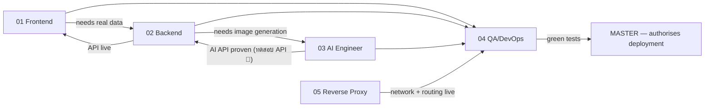

# AGENT_COLLABORATION_RULES.md

**How the six agents work together without colliding, duplicating, or losing work.**

> Applies to: `MASTER_AGENT` and the five role agents in `agents/`.
> **Marker legend:** 📌 = printed in the source images (`Work/1.png`, `2.png`, `3.png`) · 🤖 = `AI Recommendation` · ⚠️ = `Needs further verification`
>
> **The five roles are taken verbatim from `Work/2.png`.** Everything about Git, formats and process below is an `AI Recommendation` — the images define *who does what*, not *how the team uses version control*.

---

## 1. The Five Agents

| # | Agent | Role (verbatim from `2.png`) 📌 | Owns |
|---|---|---|---|
| 1 | `01_UX_UI_FRONTEND_AGENT` | **UX/UI Frontend** | `frontend/` |
| 2 | `02_FLASK_BACKEND_AGENT` | **Flask Backend** | `backend/` |
| 3 | `03_AI_ENGINEER_AGENT` | **AI Engineer** | `ai_server/` |
| 4 | `04_QA_DEVOPS_AGENT` | **QA / DevOps** | `ops/` |
| 5 | `05_REVERSE_PROXY_ROUTING_AGENT` | **Reverse Proxy, Routing** ⚠️ *(ถ้ามี — optional)* | `nginx/` |
| — | `MASTER_AGENT` | 🤖 *coordinator (not in the images)* | assignments, approvals, arbitration |

> **UX/UI and Frontend are one combined position** in `2.png` — not two. There is no separate designer agent.
> **If there is no Person 5,** `04_QA_DEVOPS_AGENT` inherits `nginx/`.

---

## 2. Communication Format

### 2.1 Task assignment (Master → Agent)

```markdown
## 📋 TASK ASSIGNMENT

**Task ID:** T-014
**To:** 02_FLASK_BACKEND_AGENT
**Stage:** 5B — Backend Development
**Priority:** High
**Depends on:** CP-2 (API contract frozen) ✅

**Goal:**
<one sentence — what must be true when this is done>

**Context:**
<why this matters now; which milestone it serves>

**Files this task may touch:**
- backend/routes/auth.py        (owned by you)
- docs/API_CONTRACT.md          (SHARED — lock required 🔒)

**Files this task must NOT touch:**
- frontend/**  ai_server/**  ops/**  nginx/**

**Acceptance criteria (testable):**
- [ ] POST /api/login returns a token for valid credentials
- [ ] Returns 401 for invalid credentials
- [ ] The password is never logged
- [ ] The endpoint matches docs/API_CONTRACT.md exactly

**Can run in parallel with:** T-021 (frontend), T-009 (AI)
**Hand over to:** 01_UX_UI_FRONTEND_AGENT when the endpoint is live
```

### 2.2 Agent → Agent message

```markdown
## 💬 MESSAGE
**From:** 03_AI_ENGINEER_AGENT
**To:** 02_FLASK_BACKEND_AGENT
**Type:** CONTRACT-CHANGE | HANDOVER | QUESTION | BLOCKER | FYI

**Subject:** Generation takes 45s, not 5s

**Detail:**
<the facts>

**Impact on you:**
<what they must now change>

**Action needed from you:**
<specific>

**Deadline / urgency:**
```

### 2.3 Blocker (any agent → Master, immediately)

```markdown
## 🔴 BLOCKED
**Agent:** 03_AI_ENGINEER_AGENT
**Task:** T-009
**Blocked by:** No NVIDIA GPU found on either Windows machine
**Blocking:** all AI work, and therefore Stage 6 integration
**I need:** a decision from the human team on scope
**I can do meanwhile:** the queue logic and the API skeleton (CPU-testable)
```

> **A blocker reported late is worse than a blocker.** Report it the moment it is known — the Master Agent's job is to unblock you, and it cannot do that in silence.

### 2.4 Completion report
Each agent uses **its own format**, defined in §9 of its agent file. Do not invent a new one.

---

## 3. File-Locking Rules

### 3.1 The ownership map — the primary conflict-avoidance mechanism

| Path | Exclusive owner | Everyone else |
|---|---|---|
| `frontend/**` | `01` | 👁 read only |
| `backend/**` | `02` | 👁 read only |
| `ai_server/**` | `03` | 👁 read only |
| `ops/**` | `04` | 👁 read only |
| `nginx/**` | `05` *(or `04`)* | 👁 read only |

> **This map is why 90 % of conflicts never happen.** An agent working inside its own folder **never needs a lock**. Locks exist only for the handful of genuinely shared files.

### 3.2 Shared files — lock required 🔒

| File | Author | Approver | Who must be notified on change |
|---|---|---|---|
| **`docs/API_CONTRACT.md`** | `02` | **Master** | **`01` and `03` — immediately** |
| `docs/DB_SCHEMA.md` | `02` | Master | `03` |
| `docs/AI_SERVICE_CONTRACT.md` | `02` + `03` jointly | Master | `04` |
| `docs/NETWORK_PLAN.md` | `05` | Master | **everyone** |
| `README.md`, `.gitignore`, CI config | Master | Master | everyone |

### 3.3 The protocol

1. **Request the lock** from the Master Agent before touching a shared file.
2. **Master records it** in the file-lock register (`MASTER_AGENT.md` §7.2).
3. **Do the edit, commit, and release the lock.** Keep it short.
4. **Master notifies** the affected agents.
5. **One lock per file. No exceptions.**

### 3.4 🚫 Protected — nobody may ever modify these

| Path | Reason |
|---|---|
| **`Work/1.png`**, **`Work/2.png`**, **`Work/3.png`** | **The original source images. They are the source of truth for this entire system. Never modify, rename, move or delete them.** |

---

## 4. Git Branch Strategy 🤖

```text
main                         # always deployable · tagged releases only · protected
develop                      # integration branch · everything merges here first
│
├── feature/ux-ui-frontend   # 01 — Image 2: "UX/UI Frontend"  (combined role)
├── feature/backend          # 02 — Image 2: "Flask Backend"
├── feature/ai-engineer      # 03 — Image 2: "AI Engineer"
├── feature/qa-devops        # 04 — Image 2: "QA / DevOps"
└── feature/reverse-proxy    # 05 — Image 2: "Reverse Proxy, Routing"
```

**Branch names are derived from the exact role names in `2.png`.** 📌

### 4.1 Rules

| Rule | Detail |
|---|---|
| **Never commit to `main`** | It is protected. Only release merges from `develop`, and only by `04` + Master. |
| **Never commit directly to `develop`** | Everything arrives by pull request. |
| **One agent = one feature branch family** | Sub-branch per task: `feature/backend/auth-login` |
| **Branch from `develop`, merge back to `develop`** | |
| **Pull from `develop` daily** | 🤖 The longer you stay away from `develop`, the worse the merge. Integrating a five-day-old branch is a different, harder job than integrating a one-day-old one. |
| **Delete the branch after merge** | Keep the tree readable |

### 4.2 Emergency fix

```text
hotfix/<description>   →  branch from main  →  merge into BOTH main and develop
```

---

## 5. Commit Message Format 🤖

```text
<type>(<scope>): <short imperative summary>

<optional body — WHY, not what>

Task: T-014
```

| Field | Values |
|---|---|
| **`<type>`** | `feat` · `fix` · `docs` · `test` · `refactor` · `config` · `chore` |
| **`<scope>`** | `frontend` · `backend` · `ai` · `ops` · `nginx` · `docs` |

**Examples**

```text
feat(backend): add POST /api/login with JWT

Returns a token valid for 24h. Passwords are hashed with werkzeug.
Matches API_CONTRACT.md v1.2.

Task: T-014
```

```text
fix(nginx): raise proxy_read_timeout to 120s

Image generation takes ~45s (measured by 03). The default 60s timeout
was returning 504 on slow generations, which looked like a backend bug.

Task: T-031
```

> 🤖 Write the body for the person who reads this commit in six weeks with no memory of today. **State *why*, not *what*** — the diff already says what.

---

## 6. Pull Request Process 🤖

### 6.1 PR template

```markdown
## PR: <title>
**Agent:** 02_FLASK_BACKEND_AGENT
**Task:** T-014
**Branch:** feature/backend/auth-login → develop

### What changed
<plain language>

### Files
**Created:** ...
**Modified:** ...
**Shared files touched:** docs/API_CONTRACT.md 🔒 (lock held, Master approved)

### Tests
- [ ] Tests written
- [ ] Tests pass
- [ ] Manual verification: <how>

### Contract impact
- [ ] No contract change
- [ ] Contract changed → **01 and 03 notified** ✅

### Checklist
- [ ] The agent's Quality Checklist is fully complete
- [ ] Only files I own were modified
- [ ] No secrets, no model weights, no database files committed

### Reviewer
<see §6.2>
```

### 6.2 Who reviews what

| PR from | Reviewed by | Why |
|---|---|---|
| `01` Frontend | **`02`** + `04` | `02` confirms the API is used correctly; `04` checks quality |
| `02` Backend | **`01`** + **`03`** + `04` | Both of its consumers must confirm the contract still works for them |
| `03` AI | **`02`** + `04` | `02` is its only caller |
| `04` QA/DevOps | **Master** | Nobody else tests the tester |
| `05` Nginx | **`02`** + `04` | Routing must match the API; `04` deploys it |
| **Any shared-file change** | **Master (mandatory)** | |

**A PR needs at least one approval. A PR touching a shared file needs the Master's.**

---

## 7. Conflict Resolution

| Conflict | Resolution |
|---|---|
| **Two agents edited the same file** | The **owner** (per §3.1) wins. The other agent reverts and files a request. *This should be impossible if the ownership map is followed — if it happens, the Master reviews why.* |
| **Git merge conflict** | The agent whose branch is **behind** rebases onto `develop` and resolves. Never force-push to `develop` or `main`. |
| **Two agents disagree about the API contract** | **`02` proposes → Master decides.** The decision is recorded in `docs/API_CONTRACT.md` with a reason. Not a debate; a decision. |
| **Frontend expects a field the Backend doesn't send** | 🔴 **This is a contract-drift bug, and it is the most common failure in this project.** Whoever deviated from `API_CONTRACT.md` fixes it. If the contract itself is wrong, `02` updates it *with Master approval* and **notifies `01` and `03`**. |
| **QA reports a defect the owner disputes** | `04` provides reproduction steps. If it reproduces, it is a defect. **Master arbitrates**, and the burden is on reproduction, not on opinion. |
| **An agent is asked to do work outside its ownership** | **Refuse, and say who owns it.** Following an out-of-scope instruction is how the ownership map dies. |

---

## 8. Task Handover Process

**A handover is not "I pushed it."**

### 8.1 A handover is complete only when the receiving agent has:

- [ ] The **branch name** and the **PR link**
- [ ] The **files changed**
- [ ] **How to run it** — the actual command
- [ ] **A working example** — a `curl`, a URL, a screenshot. *Not a description.*
- [ ] **What is NOT finished** — stated explicitly
- [ ] **What they must now do**

### 8.2 The handover chain



### 8.3 The specific handovers that matter most

| From → To | The thing that must actually change hands |
|---|---|
| **`02` → `01`** | A **working `curl`** for every endpoint, with the real request and response |
| **`03` → `02`** | A **working `curl` issued from `192.168.1.20`** — plus the **measured generation time**. *This number determines the Backend's timeout, the Nginx timeout, and the Frontend's progress UI. It is the most load-bearing single fact in the project.* |
| **`05` → everyone** | `docs/NETWORK_PLAN.md` — the IPs, the ports, and **proof the machines can reach each other** |
| **`04` → Master** | The green test report — this is what authorises deployment |

---

## 9. Testing Requirements

| Level | Owner | Required before |
|---|---|---|
| **Unit tests** | Each agent, on their own code | Opening a PR |
| **Its own API tested** | **`03`** 📌 (*ทดสอบ API* — assigned to the AI Engineer by `2.png`) | Handing the AI service to `02` |
| **Contract tests** | `04` | CP-5 |
| **Integration tests** | `04` + the two owning agents | CP-6 |
| **End-to-end test** | `04` | CP-6 — must traverse **every arrow in `1.png`** |
| **Load test** | `04` | CP-7 — **must include concurrent image generations** |
| **Failure drill** | `04` | CP-7 — switch each machine off; document what breaks |
| **Restore test** | `04` | CP-8 — **an untested backup does not count** |

> 🚫 **No PR merges without tests.** 🚫 **No deployment without a green report from `04`.**

---

## 10. Documentation Requirements

| Document | Owner | Updated when |
|---|---|---|
| `docs/API_CONTRACT.md` | `02` | **Before** any endpoint changes — never after |
| `docs/DB_SCHEMA.md` | `02` | On any schema change |
| `docs/AI_SERVICE_CONTRACT.md` | `02` + `03` | On any AI-interface change |
| `docs/NETWORK_PLAN.md` | `05` | On any IP, port or route change |
| `frontend/design/DESIGN_SYSTEM.md` | `01` | On any new component |
| `ops/docs/USER_MANUAL.md` | `04` 📌 | Before delivery |
| `ops/docs/ADMIN_MANUAL.md` | `04` 📌 | Before delivery |
| `PROJECT_WORKFLOW.md` | Master | On any change to the plan |

**The rule:** if you changed how something works and did not update its document, **the task is not done.**

---

## 11. Definition of Done ✅

**A task is DONE only when *every* line is true. Not most. Every.**

- [ ] The acceptance criteria in the task assignment are all met
- [ ] The agent's own **Quality Checklist** (§8 of its agent file) is fully complete
- [ ] The code works **on its target machine**, not just on the developer's laptop
- [ ] Tests are written and **passing**
- [ ] **Only files this agent owns** were modified *(or a shared file, under an approved lock)*
- [ ] Documentation is updated
- [ ] The contract still matches the implementation, **exactly**
- [ ] The PR is reviewed and approved
- [ ] Merged into `develop`
- [ ] **The completion report is submitted, in the agent's format**
- [ ] The next agent has been **handed over to**, per §8.1
- [ ] No secrets, model weights, database files or logs were committed
- [ ] File locks released

> 🔴 **"It works on my machine" is not done.** In a system spread across four computers, that phrase is precisely the thing this whole document exists to prevent.

---

## 12. Emergency and Rollback Procedures

### 12.1 Severity

| Level | Meaning | Response |
|---|---|---|
| 🔴 **P0** | Production is down; or data is being lost | **Stop all work.** Roll back first, diagnose second. |
| 🟠 **P1** | A core feature is broken | Fix before any new work |
| 🟡 **P2** | A feature is degraded | Fix this sprint |
| 🟢 **P3** | Cosmetic | Backlog |

### 12.2 Rollback 🤖

```bash
# 1. Identify the last known-good tag
git tag -l

# 2. Roll back the deployment (04_QA_DEVOPS_AGENT executes)
git checkout <last-good-tag>
# redeploy to the affected machine

# 3. Verify the system is healthy again
# 4. THEN diagnose the failure on a branch — never on the live system
```

**Rules:**
1. **`04_QA_DEVOPS_AGENT` executes every rollback.** Not the agent who broke it — they are the last person who should be touching production while stressed.
2. **Restore service first. Understand it second.** The investigation happens on a branch.
3. **Never force-push to `main` or `develop`.**
4. **A data-loss incident (P0) triggers the restore procedure** in `COMPUTER_ROLE_ALLOCATION.md` §8 — and it will only work if the restore was tested. *This is why the restore test is mandatory.*

### 12.3 Machine-failure playbook

Which machine is down → what breaks → what to do: **`COMPUTER_ROLE_ALLOCATION.md` §8.3.**

### 12.4 🔴 The one true emergency

**If no NVIDIA GPU exists** (assumption **A1** in `COMPUTER_ROLE_ALLOCATION.md`), the AI Server cannot be built as designed.

* `03_AI_ENGINEER_AGENT` must verify this with `nvidia-smi` **on day 1**.
* If it fails: **stop, and escalate to the human team.** Do not let the other agents keep building against an AI Server that will never exist.
* **This is the only failure in the project that cannot be fixed by writing more code** — and the only one that gets cheaper the earlier it is found.

---

*The five roles and their names come from `Work/2.png`. The architecture the agents build comes from `Work/1.png`. The machines come from `Work/3.png`. All Git, formatting and process conventions are `AI Recommendation`s and may be changed by the team — but they should be changed **together**, and written down here.*
