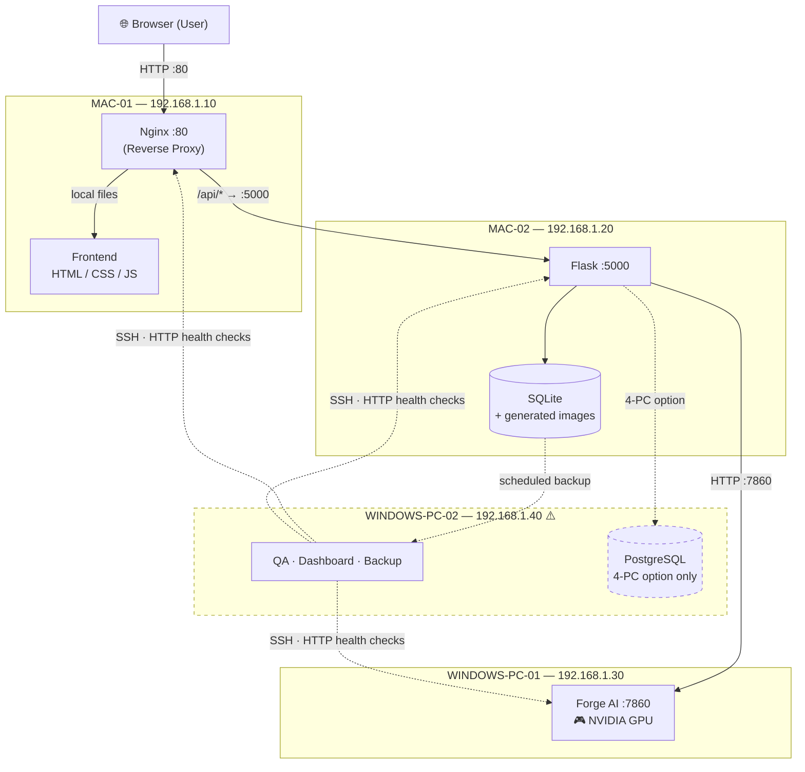

# COMPUTER_ROLE_ALLOCATION.md

**Which physical machine runs which part of the system — and why.**

> **Primary source:** `Work/3.png` (the PC topology), with `Work/1.png` (IP addresses) and `Work/2.png` (team roles).
> **Marker legend:** 📌 = printed in the source images · 🧩 = derived from the images · 🤖 = `AI Recommendation` · ⚠️ = `Needs further verification` · 🔴 = assumption that must be verified before work begins

---

## 1. ⚠️ Read this first — what `3.png` does and does not contain

### What `3.png` actually shows 📌

Title: **"Distributed System — จำนวน PCs ที่ใช้ในระบบ"** *(Number of PCs used in the system)*. Two options, drawn side by side:

| Option | Machines drawn |
|---|---|
| **ตัวอย่างการใช้คอมพิวเตอร์ 3 เครื่อง** *(3-computer example)* | `Frontend + Nginx` · `Forge AI` · `Flask + SQLite` |
| **ตัวอย่างการใช้คอมพิวเตอร์ 4 เครื่อง** *(4-computer example)* | `Frontend + Nginx` · `Forge AI` · `Flask` · `PostgreSQL` |

### What `3.png` does **NOT** contain ⚠️

**`3.png` contains no hardware information whatsoever.** Specifically, it does **not** show:

* ❌ Any **operating system** — the words "Windows" and "macOS" appear nowhere in it
* ❌ Any **CPU**
* ❌ Any **GPU**
* ❌ Any **RAM** figure
* ❌ Any **storage** figure
* ❌ Any machine model or name

It is a **service-topology diagram**, not a hardware inventory. Each circle is a PC labelled only by *the service it runs*.

> **Therefore:** the statement *"there are 4 computers: 2 Windows and 2 macOS"* comes from **the project brief, not from the image.** It is treated below as a **given fact supplied by the team**, and it is labelled as such. Every specification-dependent decision in this document is an **explicitly-flagged assumption**, exactly as instructed ("if the hardware information is incomplete, propose the safest allocation and clearly state the assumptions").

---

## 2. Given facts and stated assumptions

### 2.1 Given (from the project brief, not from the images)

| # | Fact |
|---|---|
| G1 | There are **4 computers** in total |
| G2 | **2 run Windows** |
| G3 | **2 run macOS** |

### 2.2 Assumptions — every one of these must be verified 🔴

| # | Assumption | Why it is needed | If it is false… |
|---|---|---|---|
| **A1** | **At least one Windows machine has a discrete NVIDIA GPU with enough VRAM to run Forge AI.** | Forge AI is built on PyTorch + CUDA, and **CUDA requires NVIDIA hardware**. macOS has no CUDA support at all — Apple dropped NVIDIA drivers after macOS 10.13, and Apple Silicon has never had it. | 🔴 **The AI Server as designed is not buildable.** The project must change scope immediately. See §8, risk R1. |
| **A2** | Both macOS machines can run Python, Flask, Nginx and a browser. | This is true of essentially any Mac from the last decade. | Very unlikely to be false |
| **A3** | All 4 machines are on the same LAN and can be given static IPs in `192.168.1.x`. | `1.png` demands it: *"use the Network-course knowledge to link the PCs together"* 📌 | The distributed system cannot exist |
| **A4** | Each machine is **both** a team member's development workstation **and** a server node. | `1.png` says *"สมาชิกแต่ละคน ใช้ PC แยก IP Address กัน"* — each member uses a PC with a separate IP 📌 | The allocation below would need a rethink |
| **A5** | The machines are roughly comparable in RAM/storage, except where noted. | No specs are available. | Re-balance using §2.3 |

### 2.3 🤖 How the labels are defined — the key move

Because **no specifications exist**, the four labels are **not** assigned to arbitrary physical boxes. Each label is **defined by the property that actually matters** for its job. This makes the allocation correct *without knowing the specs*:

| Label | Definition |
|---|---|
| **`WINDOWS-PC-01`** | := the Windows machine **with the (better) discrete NVIDIA GPU** |
| **`WINDOWS-PC-02`** | := the other Windows machine |
| **`MAC-02`** | := the Mac with **more RAM and more free storage** *(it will host the database and every generated image)* |
| **`MAC-01`** | := the other Mac *(the lightest workload in the system)* |

> **Day-1 action:** run `nvidia-smi` on both Windows machines and check *About This Mac* on both Macs. Record the results in `docs/NETWORK_PLAN.md`. **Ten minutes of checking now prevents the single worst failure mode in this project.**

---

## 3. The Allocation

### 3.1 Summary

| Machine | IP | Runs | Agent / Role | Type |
|---|---|---|---|---|
| **`MAC-01`** | **192.168.1.10** 📌 | **Nginx (Reverse Proxy)** + **Frontend** (HTML/CSS/JS) | `05_REVERSE_PROXY_ROUTING_AGENT` *(Nginx)* + `01_UX_UI_FRONTEND_AGENT` *(Frontend)* | **Server** (public front door) + Dev workstation |
| **`MAC-02`** | **192.168.1.20** 📌 | **Flask Backend** + **Database (SQLite)** | `02_FLASK_BACKEND_AGENT` | **Application server** + **Database server** + Dev workstation |
| **`WINDOWS-PC-01`** | **192.168.1.30** 📌 | **Forge AI** (the AI Server) | `03_AI_ENGINEER_AGENT` | **AI / GPU-processing machine** + Dev workstation |
| **`WINDOWS-PC-02`** | ⚠️ **no IP defined in any image** — 🤖 propose `192.168.1.40` | **QA / testing / deployment / monitoring / backup**, and *(4-PC option only)* **PostgreSQL** | `04_QA_DEVOPS_AGENT` | **Testing machine** + **Backup host** + *(optionally)* **Database server** |

### 3.2 Why this allocation — the reasoning chain

> **The instruction was explicit: do not assume Windows or macOS is "better." Decide from the actual requirements.** Here is the decision chain, in order of how binding each constraint is.

| # | Constraint | Strength | Consequence |
|---|---|---|---|
| 1 | **Forge AI needs CUDA. CUDA needs NVIDIA. macOS cannot provide NVIDIA.** | 🔴 **Hard — non-negotiable** | **The AI Server must be a Windows machine.** This single fact determines the entire allocation; everything else follows from it. |
| 2 | **Nginx runs best on Unix.** Nginx's own documentation describes the Windows build as having significant limitations (it runs a single worker process and does not scale). macOS is Unix. | 🟠 Strong | **Nginx → macOS.** |
| 3 | **`3.png` draws `Frontend + Nginx` as one machine** 📌 | 🧩 **Derived from the image** | The Frontend lives with Nginx → **`MAC-01`**, which `1.png` puts at **192.168.1.10** 📌 |
| 4 | **Flask + Python have first-class Unix tooling** (Gunicorn runs on Unix; Windows would need Waitress instead) | 🟡 Moderate | **Flask → the remaining Mac (`MAC-02`)**, which `1.png` puts at **192.168.1.20** 📌 |
| 5 | **`1.png` puts the database at `192.168.1.20` — the same IP as Flask** 📌 | 📌 **From the image** | **The database is co-located with Flask on `MAC-02`** |
| 6 | The second Windows machine is left. PostgreSQL runs perfectly well on Windows, and QA needs a machine anyway | 🟡 Moderate | **`WINDOWS-PC-02` → QA/DevOps + backup host** *(+ PostgreSQL if the team adopts the 4-PC option)* |

**Note what did *not* drive the decision:** neither OS was treated as inherently superior. Windows got the AI job because of **CUDA**, and macOS got Nginx because of **Nginx's own documented Windows limitations**. Both are software-compatibility facts, not preferences.

---

## 4. Machine-by-machine detail

### 4.1 `MAC-01` — Frontend + Nginx · **192.168.1.10** 📌

| | |
|---|---|
| **Main responsibility** | **Nginx reverse proxy** — the single public entry point for the whole system 📌 |
| **Secondary responsibility** | Serve the **Frontend** static files (HTML/CSS/JS); development workstation for Person 1 |
| **Machine type** | **Web server (public-facing)** + development machine |
| **Assigned agents** | `05_REVERSE_PROXY_ROUTING_AGENT` (owns Nginx) · `01_UX_UI_FRONTEND_AGENT` (owns the Frontend) |
| **Services it runs** | Nginx (🤖 port `80`) · static file serving |
| **Recommended software** 🤖 | Nginx · a code editor · Git · a browser + DevTools · `curl` |
| **Files / folders stored here** | `nginx/` · the built `frontend/` static files |
| **Why this machine** | Nginx is Unix-native and macOS is Unix (constraint 2). `3.png` pairs Frontend with Nginx on one PC (constraint 3). This is also the **lightest** workload in the system — no GPU, no database, no heavy compute — so it correctly gets the less-capable Mac. |
| **Limitations / risks** | 🔴 **Single point of failure: if this machine is down, the entire site is unreachable**, even though the Backend and the AI Server are perfectly healthy. It is the front door, and there is only one door. |
| **Backup responsibility** | Its own `nginx.conf` and the frontend build are in **Git**. Nothing irreplaceable is stored here — which is exactly why it is a good machine to put at the front. |

### 4.2 `MAC-02` — Flask Backend + Database · **192.168.1.20** 📌

| | |
|---|---|
| **Main responsibility** | **Flask Backend** — the application server and the hub of the whole system 📌 |
| **Secondary responsibility** | **Database (SQLite)** 📌 — `1.png` puts it at the same IP; storage of generated images; development workstation for Person 2 |
| **Machine type** | **Application server + Database server** + development machine |
| **Assigned agent** | `02_FLASK_BACKEND_AGENT` |
| **Services it runs** | Flask (🤖 port `5000`) · SQLite (a local file) · 🤖 Gunicorn in production |
| **Recommended software** 🤖 | Python 3.10+ · Flask · an ORM · Git · Postman/`curl` · a code editor |
| **Files / folders stored here** | `backend/` · **the database file** · **the generated images** · `backend/logs/` |
| **Why this machine** | `1.png` explicitly places both the Backend *and* the Database at `192.168.1.20` 📌. Python/Flask tooling is Unix-native (constraint 4). It gets the **higher-RAM/higher-storage Mac** (definition in §2.3) because **this is the machine that accumulates data** — every generated image and every database row lands here. |
| **Limitations / risks** | 🔴 **This machine holds the only copy of everything irreplaceable.** If it dies, the users, the history and the generated images all die with it. **It is therefore the highest-priority backup target in the project.**<br>🟠 It is also a single point of failure: if it is down, the site loads but nothing works. |
| **Backup responsibility** | 🔴 **THE critical backup source.** The database and the generated images must be backed up to `WINDOWS-PC-02` **on a schedule**, and the restore must be tested. Code lives in Git; **data does not.** |

### 4.3 `WINDOWS-PC-01` — Forge AI (the AI Server) · **192.168.1.30** 📌

| | |
|---|---|
| **Main responsibility** | **Forge AI** — image generation and image editing 📌 |
| **Secondary responsibility** | Model / LoRA storage; the job **Queue** 📌; development workstation for Person 3 |
| **Machine type** | **AI / GPU-processing machine** |
| **Assigned agent** | `03_AI_ENGINEER_AGENT` |
| **Services it runs** | Forge AI + its HTTP API (🤖 port `7860`) · the job queue |
| **Recommended software** 🤖 | Python · PyTorch · **CUDA + cuDNN** · Forge AI · `nvidia-smi` · Git |
| **Files / folders stored here** | `ai_server/` · **base model weights** · **LoRA files** *(these are large — keep them out of Git)* |
| **Why this machine** | 🔴 **Because it is the only machine that can.** Forge AI requires CUDA; CUDA requires an NVIDIA GPU; **macOS cannot provide one.** This is not a preference — it is the one truly binding hardware constraint in the entire project, and it is why a Windows machine gets the most computationally demanding job. |
| **Limitations / risks** | 🔴 **A1 is unverified: no image confirms that any NVIDIA GPU exists.** Verify with `nvidia-smi` on day 1.<br>🟠 **One GPU = one image at a time.** Concurrent requests will exhaust VRAM and crash the service — which is exactly why `2.png` names **Queue** as a deliverable 📌.<br>🟠 Model files are large; downloading them is slow. Start on day 1.<br>🟡 If this machine is down, the site works but **image generation fails** — the Backend must degrade gracefully, not hang. |
| **Backup responsibility** | Its **code** is in Git. Its **model weights are not** (too large) — instead, record the exact model names, versions and source URLs in `ai_server/config/`, so they can be re-downloaded. **A list of models is a valid backup; a 6 GB blob in Git is not.** |

### 4.4 `WINDOWS-PC-02` — QA / DevOps · ⚠️ **IP not defined in any image** (🤖 propose `192.168.1.40`)

| | |
|---|---|
| **Main responsibility** | **QA / DevOps** — system testing, deployment, dashboard, backup 📌 |
| **Secondary responsibility** | *(4-PC option only)* **PostgreSQL** 📌 (`3.png`); **Windows browser compatibility testing**; the **backup host** |
| **Machine type** | **Testing machine + Backup host** *(+ Database server, in the 4-PC option)* |
| **Assigned agent** | `04_QA_DEVOPS_AGENT` |
| **Services it runs** | Test runners · the monitoring **Dashboard** 📌 · backup jobs · *(optionally)* PostgreSQL (🤖 port `5432`) |
| **Recommended software** 🤖 | `pytest` · Postman · a load-testing tool · SSH client · PowerShell · a browser · Git · *(optionally)* PostgreSQL |
| **Files / folders stored here** | `ops/` · test reports · **backup archives** · the dashboard |
| **Why this machine** | It is the machine left after the three binding constraints are satisfied — and that is *fine*, because QA/DevOps has **no hardware requirement**; it needs network access to everything, which any machine has. There is also a genuine bonus: **the team's browser testing needs a Windows box**, and this is it. |
| **Limitations / risks** | 🟡 Lowest-criticality machine — **if it is down, the production system keeps running.** That is a deliberate property: *the machine that watches the system must not be able to take the system down.*<br>⚠️ **No image assigns this machine an IP.** One must be chosen at Stage 2. |
| **Backup responsibility** | 🔴 **This machine IS the backup destination.** It pulls the database and the generated images from `MAC-02` on a schedule and stores them. It also holds the tested **restore procedure**. |

---

## 5. How the four computers communicate



⚠️ **All port numbers on this diagram are `AI Recommendation`s. No port appears in any of the three images.** They must be confirmed at Stage 2 and recorded in `docs/NETWORK_PLAN.md`.

### 5.1 The rules of communication 📌

| Rule | Source |
|---|---|
| **The Browser talks to exactly one machine: `MAC-01` (Nginx).** | `1.png` — every request enters through Nginx |
| **Nginx forwards to the Frontend (local) and the Backend (`.20`).** Those are the *only* two arrows out of Nginx. | `1.png` |
| **Only the Backend may call the AI Server.** `1.png` draws **no** arrow from Nginx or the Browser to `192.168.1.30`. | `1.png` 📌 |
| **Only the Backend may touch the database.** | `1.png` 📌 |
| QA reaches every machine over SSH (deploy) and HTTP (health checks). | 🤖 — implied by the *Deployment · Dashboard · Backup* duties on `2.png` |

### 5.2 Direct answers to the allocation questions

| Question | Answer | Basis |
|---|---|---|
| **Which computer runs the main server?** | **`MAC-01`** runs **Nginx**, the public front door. **`MAC-02`** runs the **Flask application server** — the system's brain. | `1.png` 📌 |
| **Which computer runs the database?** | **`MAC-02`** (SQLite, co-located with Flask at `192.168.1.20`). *If the team adopts the 4-PC option:* **`WINDOWS-PC-02`** (PostgreSQL). | `1.png` 📌 / `3.png` 📌 |
| **Which computer handles AI / GPU-heavy work?** | **`WINDOWS-PC-01`** — the only machine that can run CUDA. | `1.png` + `3.png` + constraint A1 |
| **Which computers handle frontend and backend development?** | **`MAC-01`** = frontend development (Person 1). **`MAC-02`** = backend development (Person 2). Each member develops on the machine that hosts their own service. | `1.png` 📌 *("each member uses a PC with a separate IP")* |
| **Which computer is used for testing?** | **`WINDOWS-PC-02`** — QA/DevOps. It is deliberately the machine whose failure cannot take production down. | `2.png` 📌 |

---

## 6. ⚠️ Five roles, four machines

`1.png` says *"each member uses a PC with a separate IP address."* But `2.png` lists **five** roles and there are only **four** machines. This is a real tension in the source material, and here is how it resolves:

| Role | Machine | How |
|---|---|---|
| Person 1 — UX/UI Frontend | `MAC-01` | Owns the Frontend on it |
| Person 2 — Flask Backend | `MAC-02` | Owns the Backend + DB on it |
| Person 3 — AI Engineer | `WINDOWS-PC-01` | Owns Forge AI on it |
| Person 4 — QA / DevOps | `WINDOWS-PC-02` | Owns testing/deployment/backup; **works across all four** |
| **Person 5 — Reverse Proxy, Routing** *(ถ้ามี)* | **shares `MAC-01`** 🤖 | Nginx **lives on `MAC-01`** 🧩, so Person 5 works there alongside Person 1 |

**This is not a flaw in the plan — it is a property of the roles.** Persons 4 and 5 own *cross-cutting concerns* (quality and networking), not *boxes*. And `2.png` itself marks Person 5 as optional (*ถ้ามี*) with a **light workload** — so sharing a machine is entirely consistent with the source.

**If there is no Person 5:** `04_QA_DEVOPS_AGENT` inherits Nginx and routing.

---

## 7. Source-code synchronisation, Git and shared folders

### 7.1 🤖 Source code syncs through **Git — never through a shared folder**

A shared network folder for source code across four machines is a guaranteed way to lose work: no history, no conflict detection, no way to know who changed what. **Use a Git remote (GitHub or equivalent). Every machine clones it; every machine pushes to it.** This also means the source code is inherently backed up on four machines plus the remote.

### 7.2 Branch structure

```text
main                         # always deployable; tagged releases only
develop                      # integration branch; all features merge here first
feature/ux-ui-frontend       # Person 1  (Image 2: "UX/UI Frontend" — one combined role)
feature/backend              # Person 2  (Image 2: "Flask Backend")
feature/ai-engineer          # Person 3  (Image 2: "AI Engineer")
feature/qa-devops            # Person 4  (Image 2: "QA / DevOps")
feature/reverse-proxy        # Person 5  (Image 2: "Reverse Proxy, Routing")
```

*(Branch names are derived from the exact role names in `2.png`. Full workflow: `AGENT_COLLABORATION_RULES.md`.)*

### 7.3 What must **NOT** go into Git 🚫

| Item | Where it lives instead | Why |
|---|---|---|
| **Model weights, LoRA files** | On `WINDOWS-PC-01` only; record names + URLs in `ai_server/config/` | Hundreds of MB to several GB — they will make the repo unusable |
| **The database file** | On `MAC-02`; backed up to `WINDOWS-PC-02` | It is data, not code. It changes constantly |
| **Generated images** | On `MAC-02`; backed up to `WINDOWS-PC-02` | Same |
| **`.env` / secrets** | On each machine, gitignored. Commit `.env.example` only | Never commit a secret |
| **Logs** | On each machine, gitignored | |

### 7.4 What a shared folder / SCP **is** for 🤖

Not source code — but these are legitimate:
* Pushing **deployment artifacts** to a target machine (`scp` / `rsync` / `robocopy`)
* Pulling **backups** from `MAC-02` to `WINDOWS-PC-02`
* Moving **model files** between machines without going through Git

### 7.5 API communication between machines

Machines do **not** share filesystems at runtime. They talk over **HTTP**, exactly as `1.png` draws it: Nginx → Flask, Flask → AI Server. The **API contract** (`docs/API_CONTRACT.md`) and the **AI-service contract** (`docs/AI_SERVICE_CONTRACT.md`) are what make this work; they are the most important documents in the project.

---

## 8. Backup and Recovery Plan

**Owner: `04_QA_DEVOPS_AGENT` on `WINDOWS-PC-02`** — *Backup* is one of their five named deliverables 📌.

### 8.1 What must be backed up

| Priority | What | From | To | Frequency 🤖 |
|---|---|---|---|---|
| 🔴 **1** | **The database** | `MAC-02` | `WINDOWS-PC-02` | Daily — *irreplaceable* |
| 🔴 **2** | **The generated images** | `MAC-02` | `WINDOWS-PC-02` | Daily — *irreplaceable* |
| 🟠 3 | Configuration (`nginx.conf`, `.env` templates) | `MAC-01`, all | Git + `WINDOWS-PC-02` | On change |
| 🟡 4 | Source code | All | **Git remote** | Every push — *this is automatic* |
| 🟡 5 | Model / LoRA **names, versions and URLs** *(not the files)* | `WINDOWS-PC-01` | Git (`ai_server/config/`) | On change — *re-downloadable, so a list is enough* |

### 8.2 The rule that makes a backup real

> 🔴 **A backup that has never been restored is not a backup — it is a hope.**
> `04_QA_DEVOPS_AGENT` must perform a **test restore** into a scratch location and prove the restored database actually works. Until that is done, the backup checkbox stays unticked.

### 8.3 What happens if a computer is unavailable

| Machine down | What breaks | What still works | Recovery 🤖 |
|---|---|---|---|
| **`MAC-01`**<br>*(Nginx + Frontend)* | 🔴 **The entire site is unreachable.** No user can reach anything. | Everything internally — the Backend and AI Server are healthy but have no front door | Nginx config is in Git. **Stand it up on any other Mac, or temporarily expose Flask directly.** Recovery is fast *because nothing irreplaceable lives here* |
| **`MAC-02`**<br>*(Flask + DB)* | 🔴 **Everything except static pages.** No login, no data, no generation. **And the live data is on this machine.** | Static pages load; the AI Server idles | **This is the worst failure.** Restore the database from the `WINDOWS-PC-02` backup onto a replacement machine, redeploy Flask from Git. **The recovery is only as good as the last backup — which is why priority 1 and 2 above matter.** |
| **`WINDOWS-PC-01`**<br>*(Forge AI)* | 🟠 **Image generation and editing fail.** | Login, browsing, history, the gallery — everything except making new images | Backend must **degrade gracefully** and show a clear error, not hang. Redeploy from Git and **re-download the models** using the recorded list |
| **`WINDOWS-PC-02`**<br>*(QA / Backup)* | 🟡 **Nothing in production.** Testing, the dashboard and backups pause. | The entire user-facing system | 🔴 **But the backup destination is gone.** Take a manual backup elsewhere until it returns. *(This is the argument for a second backup copy — e.g. an external drive.)* |

> 🤖 **Notice the deliberate design:** the machine that holds the irreplaceable data (`MAC-02`) is **not** the machine exposed to the public (`MAC-01`), and the machine that monitors everything (`WINDOWS-PC-02`) **cannot take production down**. That layering is intentional and worth preserving.

---

## 9. The two topology options — which to choose

`3.png` offers both. The team must decide (this is **CP-1** in `PROJECT_WORKFLOW.md`).

| | **Option A — 3-PC services + 1 QA machine** 🤖 *recommended* | **Option B — the 4-PC layout from `3.png`** |
|---|---|---|
| `MAC-01` | Frontend + Nginx | Frontend + Nginx |
| `MAC-02` | **Flask + SQLite** | Flask |
| `WINDOWS-PC-01` | Forge AI | Forge AI |
| `WINDOWS-PC-02` | **QA / testing / backup** | **PostgreSQL** *(+ QA)* |
| Matches `1.png`? | ✅ **Exactly** — SQLite at `192.168.1.20` 📌 | ⚠️ No — `1.png` says SQLite, co-located |
| Matches `3.png`? | ✅ The 3-computer example 📌 | ✅ The 4-computer example 📌 |
| Setup cost | **Very low** — SQLite is a file | Higher — install, configure and secure PostgreSQL |
| Gives QA a machine? | ✅ Yes | ⚠️ Shared with the database |

### 🤖 Recommendation

**Start with Option A.** It matches `1.png` **exactly**, it costs nothing to set up, and it gives QA/DevOps a real machine to work from. Then **migrate to Option B** (PostgreSQL on `WINDOWS-PC-02`) once the end-to-end path works — `3.png` explicitly presents it as a valid target, and the migration is cheap **if and only if** `02_FLASK_BACKEND_AGENT` puts every query behind an ORM from day one.

> This is a genuine choice, and it belongs to the team — both options are drawn in the source image. It is recorded as **Open Question 1** in `PROJECT_WORKFLOW.md` §15.

---

## 10. Open questions — `Needs further verification`

| # | Question | Blocks | Who resolves |
|---|---|---|---|
| 1 | 🔴 **Does either Windows machine have a discrete NVIDIA GPU, and how much VRAM?** No image says. | **Everything about the AI Server** | `03_AI_ENGINEER_AGENT`, **day 1**, with `nvidia-smi` |
| 2 | **What IP does the 4th machine get?** `1.png` defines only `.10`, `.20`, `.30`. | Network configuration | `05_REVERSE_PROXY_ROUTING_AGENT`, Stage 2 |
| 3 | **What ports?** No port appears in any image. | Nginx routing; every integration | `05` + `02` + `03`, Stage 2 |
| 4 | **Option A or Option B?** (SQLite vs PostgreSQL) | The data layer and this machine allocation | The team, at CP-1 |
| 5 | **Is there a 5th team member?** `2.png` says *ถ้ามี* ("if there is one"). | Who owns Nginx | The team, at CP-1 |
| 6 | **RAM and storage on each machine** — no image says. The `MAC-01`/`MAC-02` split assumes one Mac has more of both. | Which Mac gets the Backend | Check *About This Mac*, day 1 |

---

*Topology from `Work/3.png`. IP addresses from `Work/1.png`. Roles from `Work/2.png`. **No hardware specification or operating system appears in any of the three images** — every specification-dependent choice above is a clearly-labelled assumption, and every one of them can be checked in under ten minutes.*
