# FLOWCHART.md

**Every flow in the project, in one place.** Planning, building, running, failing, recovering.

> **Source of truth:** `Work/1.png` (architecture), `Work/2.png` (roles), `Work/3.png` (machines).
> **Marker legend:** 📌 = from the images · 🧩 = derived from the images · 🤖 = `AI Recommendation` · ⚠️ = `Needs further verification`

---

## Contents

| # | Flowchart | Answers the question |
|---|---|---|
| 1 | [The whole project, end to end](#1-the-whole-project-end-to-end) | *What happens, in what order, from nothing to deployed?* |
| 2 | [The planning flow](#2-the-planning-flow) | *How does an idea become an assigned task?* |
| 3 | [The working system — runtime](#3-the-working-system--runtime) | *What actually happens when a user clicks "Generate"?* |
| 4 | [The working system — sequence](#4-the-working-system--sequence-diagram) | *Same thing, showing the timing and the waiting* |
| 5 | [Parallel vs sequential work](#5-parallel-vs-sequential-work) | *Who can work at the same time as whom?* |
| 6 | [The agent working loop](#6-the-agent-working-loop) | *How does one agent take a task from start to handover?* |
| 7 | [The Master Agent coordination loop](#7-the-master-agent-coordination-loop) | *How does work get assigned and reviewed?* |
| 8 | [Task routing decision tree](#8-task-routing--which-agent-gets-this) | *Given a task, whose is it?* |
| 9 | [The integration flow](#9-the-integration-flow) | *In what order do the pieces get connected?* |
| 10 | [Testing flow](#10-testing-flow) | *What gets tested, by whom, when?* |
| 11 | [Deployment flow](#11-deployment-flow) | *How does code get onto the four machines?* |
| 12 | [Failure and rollback](#12-failure-and-rollback) | *What do we do when it breaks?* |
| 13 | [Git branch flow](#13-git-branch-flow) | *How does code move from a branch to production?* |
| 14 | [The state of a single task](#14-the-life-of-a-single-task) | *What states does a task pass through?* |

---

## 1. The whole project, end to end

**The master flowchart.** Red = the two places the project can die. Orange = the gate that unlocks parallel work.

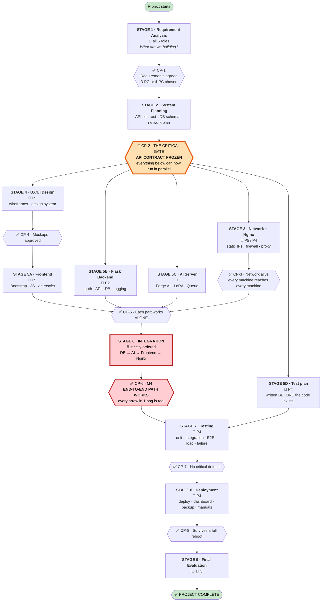

**Read this chart for one thing: the shape.** Everything is a single narrow line until **CP-2**, then it explodes into five parallel tracks, then it funnels back into **Stage 6**. Those two pinch points are where the project is won or lost — the contract gate at the top, and integration at the bottom.

---

## 2. The planning flow

**How an idea becomes an assigned task.** This is the loop the Master Agent runs continuously.

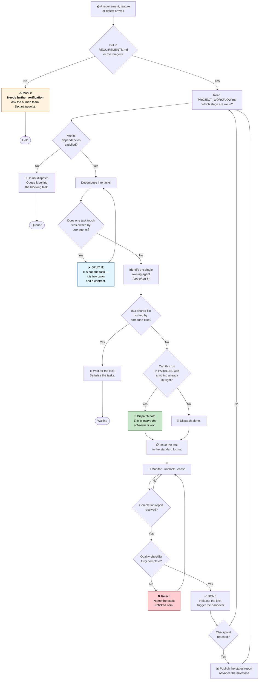

---

## 3. The working system — runtime

**What physically happens when a user asks for an image.** Every arrow here is drawn in `1.png` 📌.

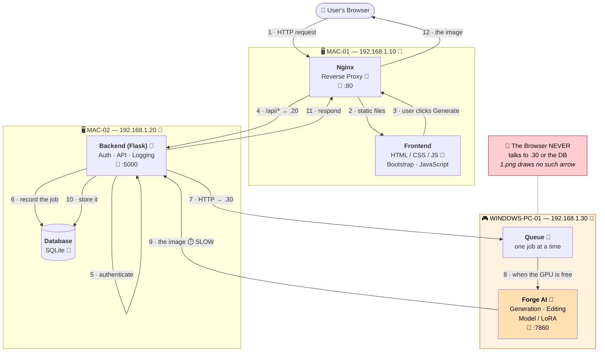

**The single most important structural fact in this diagram:** there is **no arrow from the browser to the AI Server.** Every AI request is brokered by the Backend — that is what makes authentication, logging and the queue possible at all. An agent who "optimises" by calling `.30` directly from JavaScript has destroyed all three.

---

## 4. The working system — sequence diagram

**The same flow, but showing the thing the boxes hide: the waiting.**

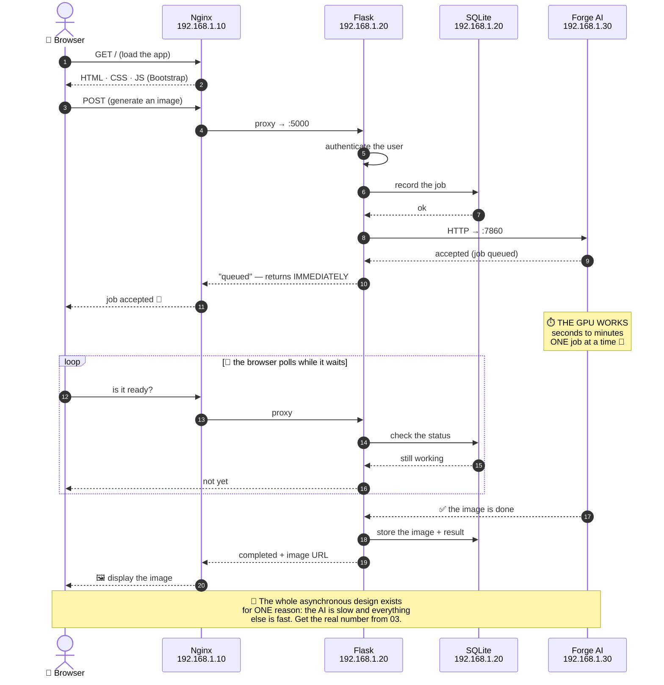

> ⚠️ The *accept-then-poll* pattern is an **`AI Recommendation`** — it is **not** drawn in the images. But it is forced by physics: a browser cannot hold an HTTP connection open for a minute-long GPU job. **The alternative — a blocking request — will fail with a 504 the first time a generation runs long.**

---

## 5. Parallel vs sequential work

**Who can work at the same time as whom.** The green band is where four people build simultaneously.

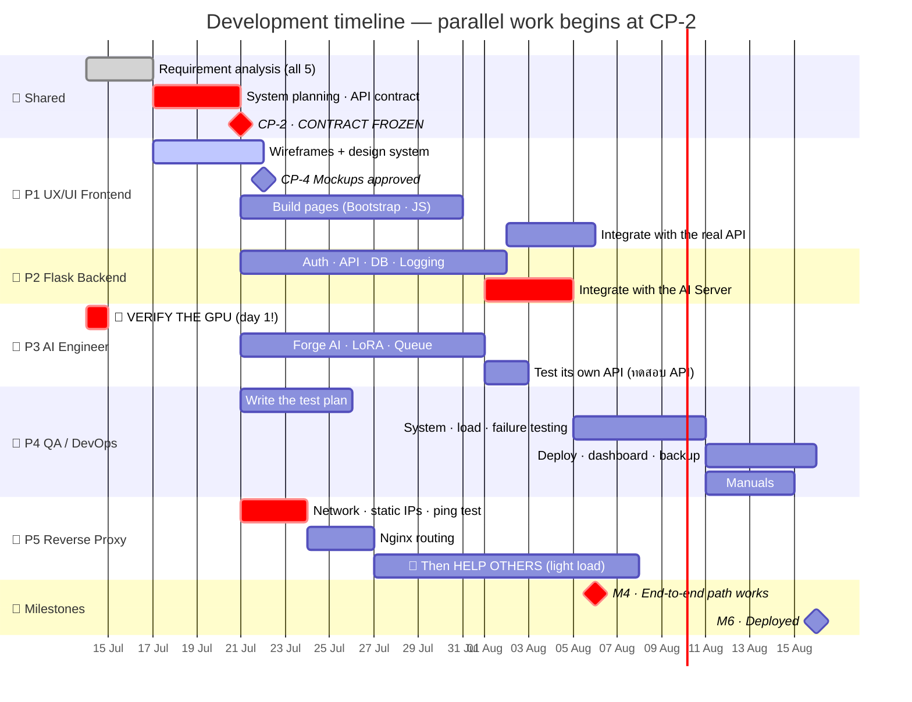

**Three things this chart tells you that a task list cannot:**
1. **P3 verifies the GPU on day 1** — before anything else, because everything depends on it.
2. **Nothing parallel happens before CP-2.** The contract is not paperwork; it is the starting gun.
3. **P5 finishes early and then helps** — exactly as `2.png` instructs (*"ช่วยงานส่วนอื่น เพราะภาระงานต่ำ"*) 📌.

---

## 6. The agent working loop

**How any one of the five agents takes a task from inbox to handover.** Identical for all five.

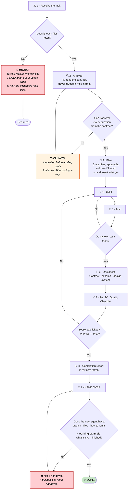

---

## 7. The Master Agent coordination loop

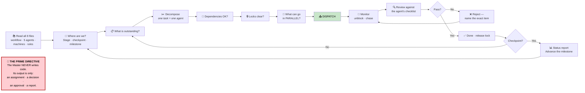

---

## 8. Task routing — which agent gets this?

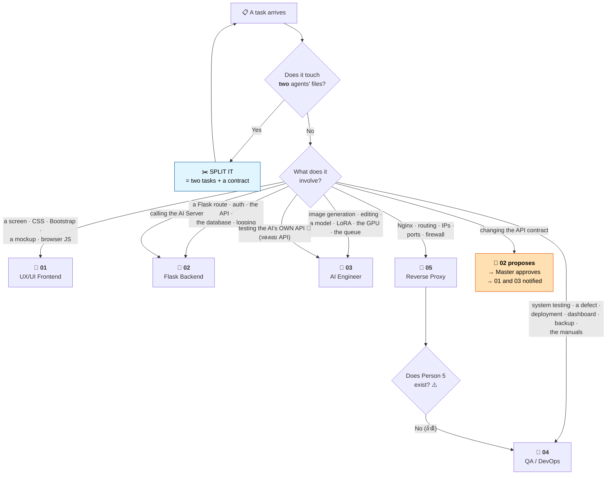

> **Two routing rules people get wrong:**
> • **Calling the AI Server is a *Backend* task**, not an AI task. The AI Engineer builds the service; the Backend calls it. 📌
> • **Testing the AI's own API is an *AI Engineer* task**, not a QA task — `2.png` assigns *ทดสอบ API* to คนที่ 3. 📌

---

## 9. The integration flow

**Strictly ordered. This is where projects die.**

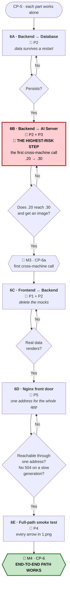

> 🔴 **Schedule 6B early — on stubs if you must.** It is the first moment two separately-built machines must agree, and it crosses a network boundary *and* a slow-job boundary at the same time. Teams that leave it until the end discover both problems in the same week, with no time left.

---

## 10. Testing flow

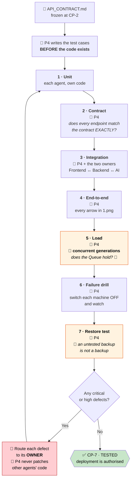

---

## 11. Deployment flow

**Start what others depend on, first.**

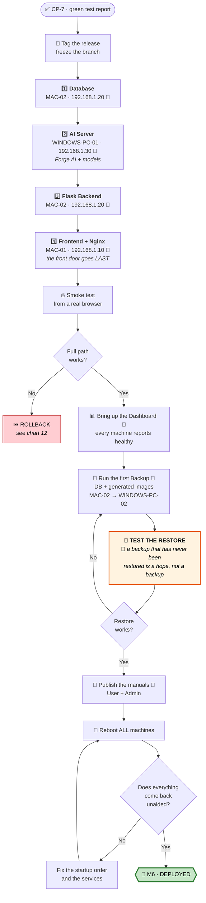

**The deployment order is not arbitrary:** the database has no dependencies, so it starts first. The front door starts last — because there is no point opening it onto a system that is not yet awake.

---

## 12. Failure and rollback

### 12.1 Which machine died?

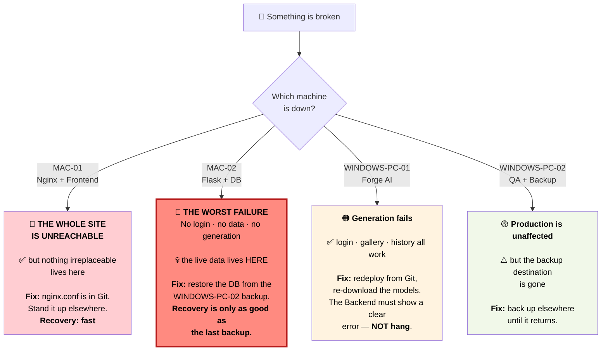

> **This layering is deliberate:** the machine holding the irreplaceable data (`MAC-02`) is **not** the one exposed to the public (`MAC-01`), and the machine that watches everything (`WINDOWS-PC-02`) **cannot take production down**. Preserve that property.

### 12.2 The rollback procedure

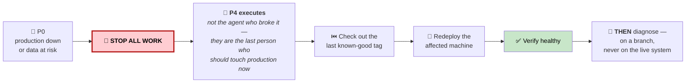

**Restore service first. Understand it second.**

### 12.3 🔴 The one true emergency

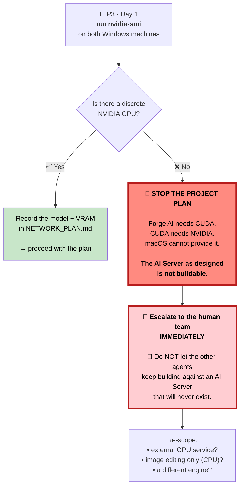

> ⚠️ **No image states any hardware specification.** This is **assumption A1** in `COMPUTER_ROLE_ALLOCATION.md`, and it is the only failure in the project that **cannot be fixed by writing more code** — and the only one that gets dramatically cheaper the earlier it is found. **It costs ten minutes to check.**

---

## 13. Git branch flow

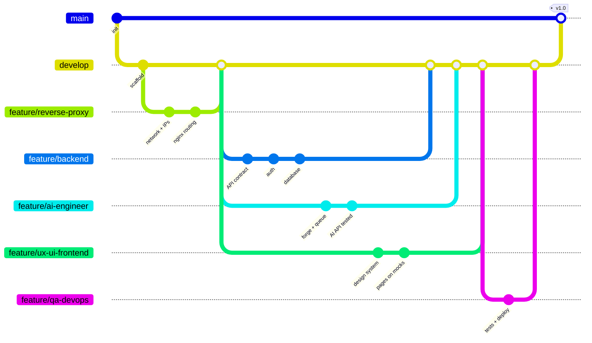

**Branch names come from the exact role names in `2.png`** 📌. Note the shape: three feature branches run **side by side** off `develop` — that is CP-2 doing its job.

---

## 14. The life of a single task

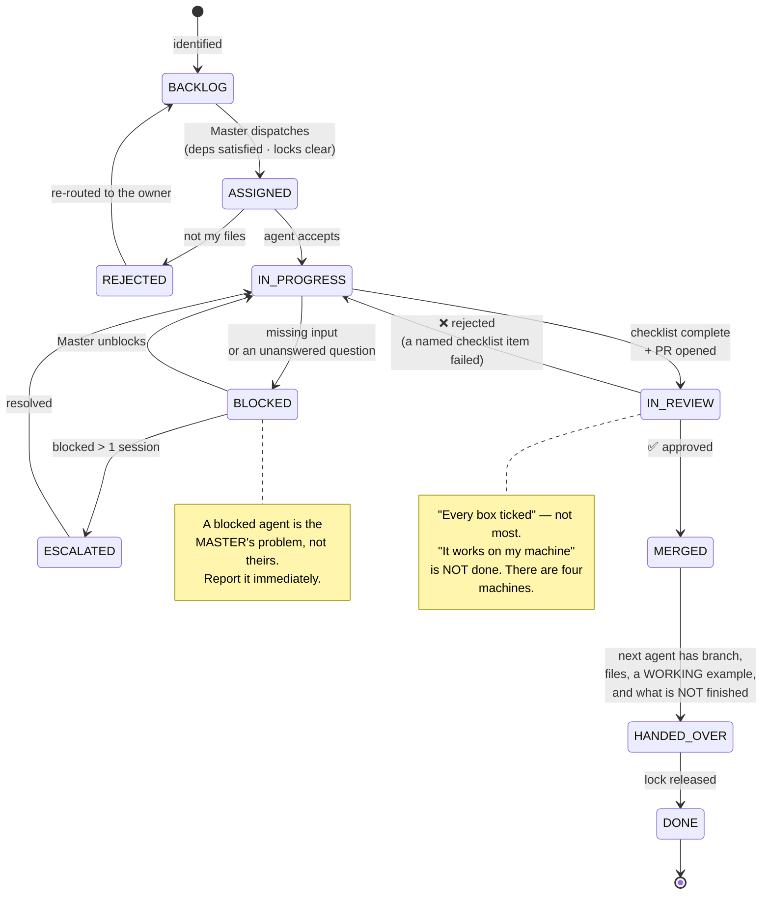

---

## Quick index — which chart do I need?

| I want to… | Chart |
|---|---|
| See the whole project at a glance | **1** |
| Understand how tasks get created and assigned | **2**, **7** |
| Understand how the app actually works at runtime | **3**, **4** |
| Know who can work at the same time | **5** |
| Know what to do with the task I was just given | **6** |
| Work out whose job something is | **8** |
| Connect the pieces together | **9** |
| Know what to test and when | **10** |
| Ship it | **11** |
| Deal with something breaking | **12** |
| Use Git correctly | **13** |
| Know what state my task is in | **14** |

---

*Architecture from `Work/1.png`. Roles from `Work/2.png`. Machines from `Work/3.png`. Anything marked 🤖 is an AI recommendation. Anything marked ⚠️ is not stated in any image and must be confirmed by the team.*
