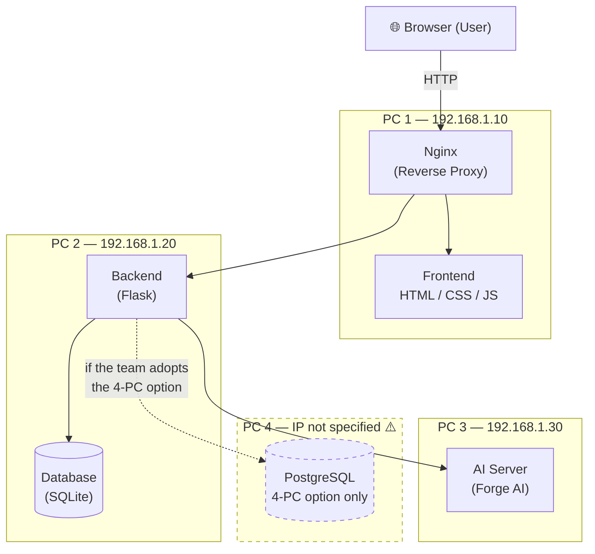
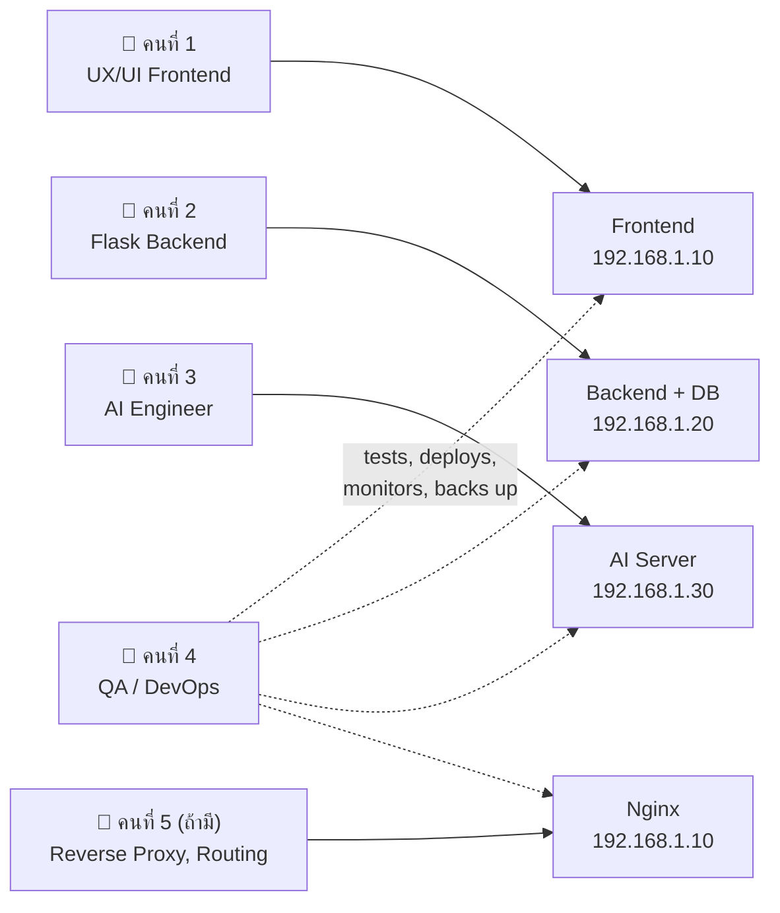
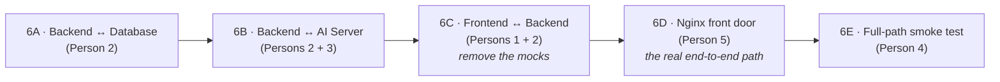
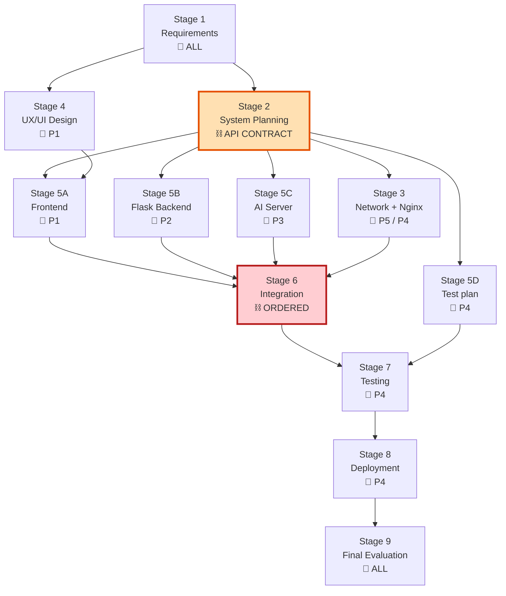

# PROJECT_WORKFLOW.md

**The project concept, dependency map, and development order for the distributed Web App.**

> **Primary source:** `Work/1.png` (the *Distributed System* architecture diagram).
> Supporting sources: `Work/2.png` (team roles) and `Work/3.png` (number of PCs).

---

## Legend — how to read this document

| Marker | Meaning |
|---|---|
| 📌 **From the image** | Printed in one of the 3 source images. This is the source of truth. |
| 🧩 **Derived** | Logically forced by combining two or more image facts. The derivation is always shown. |
| 🤖 **AI Recommendation** | Added by AI. **Not** in the images. Safe to change; the team decides. |
| ⚠️ **`Needs further verification`** | Missing, unreadable, or contradictory in the images. Must be resolved by the team. |

---

## 1. What the images actually say

### 1.1 `1.png` — "Distributed System" 📌

Two notes are printed on the slide:

> **สมาชิกแต่ละคน ใช้ PC แยก IP Address กัน**
> *Each member uses a PC, with a separate IP address.*

> **ให้ใช้ความรู้จากรายวิชา Network เพื่อทำให้ PCs เชื่อมโยงกัน / แต่ละเครื่องทำหน้าที่แตกต่างกัน**
> *Use the knowledge from the Network course to link the PCs together. Each machine performs a different function.*

The flow drawn on the slide, exactly as arrowed:

| From | To | Note |
|---|---|---|
| **Browser (User)** | **Nginx (Reverse Proxy)** | The single entry point. **No IP is printed for Nginx.** ⚠️ |
| **Nginx** | **Frontend (HTML / CSS / JS)** | **192.168.1.10** |
| **Nginx** | **Backend (Flask)** | **192.168.1.20** |
| **Backend (Flask)** | **AI Server** | **192.168.1.30** |
| **Backend (Flask)** | **Database (SQLite)** | **192.168.1.20** — *the same IP as the Backend, i.e. co-located on one machine* |

### 1.2 `2.png` — "การแบ่งหน้าที่ในกลุ่ม (ตัวอย่าง)" *(Division of duties in the group — **example**)* 📌

| # | สมาชิก (Member) | หน้าที่ (Role) | สิ่งที่ส่งมอบ (Deliverables) |
|---|---|---|---|
| 1 | คนที่ 1 | **UX/UI Frontend** | หน้าเว็บ *(web pages)*, Bootstrap, JavaScript |
| 2 | คนที่ 2 | **Flask Backend** | Authentication, API, Database, Logging |
| 3 | คนที่ 3 | **AI Engineer** | Image Generation, Image Editing, Model/LoRA, ทดสอบ API *(API testing)*, Queue |
| 4 | คนที่ 4 | **QA / DevOps** | ทดสอบระบบ *(system testing)*, เขียนคู่มือ *(write manuals)*, Deployment, Dashboard, Backup |
| 5 | **คนที่ 5 (ถ้ามี)** — *"if there is one"* | **Reverse Proxy, Routing** | *(ช่วยงานส่วนอื่น เพราะภาระงานต่ำ)* — *helps with other parts, because the workload is light* |

> **UX/UI and Frontend are one combined position** (`UX/UI Frontend`), not two. The agent file is therefore `01_UX_UI_FRONTEND_AGENT.md`.
> **Position 5 is optional** (*ถ้ามี*). The workflow below must survive its absence — see §9.5.
> The slide title itself says **(ตัวอย่าง) = "(example)"**, so this split is the instructor's suggested model, not a fixed contract.

### 1.3 `3.png` — "จำนวน PCs ที่ใช้ในระบบ" *(Number of PCs used in the system)* 📌

Two options are drawn side by side:

| Option | Machines |
|---|---|
| **ตัวอย่างการใช้คอมพิวเตอร์ 3 เครื่อง** *(3-computer example)* | `Frontend + Nginx` · `Forge AI` · `Flask + SQLite` |
| **ตัวอย่างการใช้คอมพิวเตอร์ 4 เครื่อง** *(4-computer example)* | `Frontend + Nginx` · `Forge AI` · `Flask` · `PostgreSQL` |

🧩 **Derived fact — where Nginx lives.** `3.png` shows **`Frontend + Nginx` on one single machine**, and `1.png` puts the Frontend at **192.168.1.10**. Therefore **Nginx runs on 192.168.1.10**. This is not an assumption; it follows from the two images together.

### 1.4 What the images do **not** say ⚠️

The following are **absent from all three images** and must not be invented:

* **Port numbers** for Nginx, Flask, or the AI Server.
* **API endpoint names** (`/api/...`) — no endpoint list appears anywhere.
* **Database schema** — no tables or columns.
* **An IP address for the 4th machine** (the PostgreSQL box in the 4-PC option). `1.png` only defines `.10`, `.20`, `.30`.
* **Any hardware specification** — no CPU, GPU, RAM, storage, or operating system appears in *any* image, including `3.png`. See `COMPUTER_ROLE_ALLOCATION.md` §2.
* **Deadlines, sprint lengths, or a calendar.**

---

## 2. Project Concept

**A distributed, AI-powered image web application.** A user opens a browser and reaches a single front door (**Nginx**). Nginx serves the **Frontend** and forwards application requests to the **Flask Backend**. The Backend is the brain: it authenticates the user, records everything in the **Database**, and delegates the heavy image work to a separate **AI Server** running **Forge AI** on its own machine.

The defining constraint, stated on `1.png` itself, is that this is not one program on one computer — **it is one system spread across several computers, each with its own IP address and its own job.** Getting those machines to talk to each other reliably is a first-class part of the project, not an afterthought.

## 3. Main Objective

> **Build and deploy a working distributed web application in which a browser request travels Browser → Nginx → Frontend/Flask → (AI Server + Database) and returns a generated or edited image — with each of the 4 machines performing a different, well-defined function.** 📌 (`1.png`)

Success = every arrow drawn on `1.png` is a real, tested, monitored network call.

---

## 4. System Architecture (from `1.png` + `3.png`)

**⚠️ The database is ambiguous across the images.** `1.png` shows **SQLite at 192.168.1.20** (co-located with Flask). `3.png`'s 4-PC option shows **PostgreSQL on its own dedicated machine**. These are two different designs. The team must choose. → `Needs further verification`
🤖 **AI Recommendation:** start with **SQLite on `.20`** (matches `1.png` exactly, zero setup cost), and treat **PostgreSQL on a 4th machine** as a planned migration once the core flow works. Keep all database access behind an ORM so the swap is a config change, not a rewrite.

---

## 5. How the roles map onto the architecture

**Every box on `1.png` has exactly one owner.** 📌 Person 4 (QA/DevOps) is the only role that spans *all* machines — they own no single box, they own the *whole* system's quality. This is why they never have a machine of their own in the diagram.

⚠️ **Tension to resolve:** `1.png` says *"each member uses a PC with a separate IP address"* — but there are **5 roles and 4 machines** (and only 3 IPs are actually defined). Persons 4 and 5 do not get a dedicated node. See `COMPUTER_ROLE_ALLOCATION.md` §6.

---

## 6. What must be done first

**Two things must happen before anyone writes a feature — and they can happen at the same time.**

| Priority | Task | Owner | Why it is first |
|---|---|---|---|
| **P0-A** | **Freeze the API contract** (endpoint names, request/response JSON, error shapes, status codes) | Master Agent, with all 5 | This is the single artifact that **unblocks parallel work**. Once frozen, the Frontend can build against a mock, the Backend can build against the contract, and the AI Server can build to its own contract — all simultaneously. Without it, everyone waits for everyone. ⚠️ *The images define no endpoints; this must be written from scratch.* |
| **P0-B** | **Make the network real** — assign the static IPs from `1.png`, open the ports, prove machine-to-machine connectivity with `ping` and `curl` | Person 5 (or Person 4 if there is no Person 5) | `1.png` explicitly demands it: *"use the knowledge from the Network course to link the PCs together."* Every arrow in the architecture is a network hop. **If the machines cannot reach each other, nothing else in this project can be integrated — and this is the failure that is hardest to debug late.** |

> 🤖 **AI Recommendation — the "Day-1 Ping Test" checkpoint.** Before any feature branch is opened, prove all six directional hops work: `.10→.20`, `.20→.30`, `.20→.10`, `.30→.20`, and the browser reaching `.10`. Record the results in `docs/NETWORK_PLAN.md`. Teams that skip this lose a week at integration.

---

## 7. The Development Workflow (9 stages)

The generic 9-stage flow, **adjusted to what `1.png`, `2.png` and `3.png` actually require**.

### Stage 1 — Requirement Analysis 🔁 *shared*

| | |
|---|---|
| **Owner** | Master Agent · **all 5 roles participate** |
| **Input** | The 3 images; the product idea |
| **Process** | Agree what the app does; list user-facing features; confirm the role split from `2.png`; choose 3-PC vs 4-PC from `3.png`; choose SQLite vs PostgreSQL |
| **Output** | `docs/REQUIREMENTS.md`; a signed-off feature list; **the PC-count decision** |
| **Depends on** | Nothing |
| **Exit checkpoint** | ✅ **CP-1:** Everyone can state, in one sentence, what the app does and which machine they own |

### Stage 2 — System Planning ⛓️ *sequential — blocks almost everything*

| | |
|---|---|
| **Owner** | Master Agent (facilitates) · Persons 2, 3, 5 lead their own contracts |
| **Input** | Stage 1 output; the architecture in `1.png` |
| **Process** | Write the **API contract**; write the **DB schema**; write the **network/IP plan**; define the repo structure and branch strategy |
| **Output** | `docs/API_CONTRACT.md` · `docs/DB_SCHEMA.md` · `docs/NETWORK_PLAN.md` · the Git repo with branches |
| **Depends on** | Stage 1 |
| **Exit checkpoint** | ✅ **CP-2 (THE critical gate):** the API contract is **frozen**. From this moment, Stages 3–5 run **in parallel**. Changing the contract after CP-2 requires Master Agent approval and notification of every affected agent. |

### Stage 3 — Network & Environment Setup 🔀 *parallel with Stage 4*

| | |
|---|---|
| **Owner** | **Person 5** (Reverse Proxy, Routing) · **Person 4** (QA/DevOps) assists |
| **Input** | `docs/NETWORK_PLAN.md`; the IPs from `1.png` |
| **Process** | Set static IPs `.10 / .20 / .30`; configure the firewall; install Nginx on `.10`; write the reverse-proxy routing rules; verify connectivity |
| **Output** | Working LAN; `nginx/nginx.conf`; a passing connectivity report |
| **Depends on** | Stage 2 (needs the IP/port plan) |
| **Exit checkpoint** | ✅ **CP-3:** every machine can reach every other machine it needs; Nginx serves a placeholder page from `.10` |

### Stage 4 — UX/UI Design 🔀 *parallel with Stage 3*

| | |
|---|---|
| **Owner** | **Person 1** (UX/UI Frontend) |
| **Input** | Stage 1 requirements |
| **Process** | Wireframes → design system (colours, fonts, components) → responsive layouts |
| **Output** | Mockups; `frontend/design/`; the agreed component library (**Bootstrap** 📌 `2.png`) |
| **Depends on** | Stage 1 only — **it does not need the API contract**, so it can start immediately |
| **Exit checkpoint** | ✅ **CP-4:** every screen in the feature list has an approved mockup |

### Stage 5 — Parallel Development 🔀🔀🔀 *the three tracks run simultaneously*

> **This is the heart of the schedule.** After CP-2, three agents build against the frozen contract without waiting for each other.

| Track | Owner | Input | Process | Output |
|---|---|---|---|---|
| **5A — Frontend** | **Person 1** | Mockups (CP-4) + API contract (CP-2) | Build the pages in HTML/CSS/JS with **Bootstrap** and **JavaScript** 📌; call the API through a **mock server** so no backend is required | `frontend/` — working UI against mocks |
| **5B — Backend** | **Person 2** | API contract + DB schema | Build **Flask**; implement **Authentication**, the **API**, the **Database** layer, and **Logging** 📌; stub the AI call | `backend/` — real API, mocked AI |
| **5C — AI Server** | **Person 3** | AI-service contract | Stand up **Forge AI** 📌 (`3.png`); implement **Image Generation**, **Image Editing**, **Model/LoRA**, and the **Queue** 📌; **ทดสอบ API** (test the AI API) 📌 | `ai_server/` — callable AI service |
| **5D — Test plan** | **Person 4** | API contract | Write the test cases *before* the code exists; build the CI skeleton | `ops/tests/` |

| | |
|---|---|
| **Depends on** | CP-2 (contract) for 5A/5B/5C; CP-4 (mockups) for 5A |
| **Exit checkpoint** | ✅ **CP-5:** each track passes its **own** tests in isolation. Frontend works against mocks. Backend answers every endpoint. AI Server generates an image on demand. |

### Stage 6 — Integration ⛓️ *sequential — this is where projects die*

Integration happens in a **fixed order**, because each step depends on the previous one being green.

| Step | Owner(s) | Input | Output | Checkpoint |
|---|---|---|---|---|
| **6A** | Person 2 | Backend + real DB | Data persists across restarts | |
| **6B** | Persons 2 + 3 | Backend + AI Server | Flask successfully calls `192.168.1.30` and gets an image back | ✅ **CP-6a** — *the first cross-machine call in the whole project* |
| **6C** | Persons 1 + 2 | Frontend + Backend | Mocks deleted; the UI runs on real data | ✅ **CP-6b** |
| **6D** | Person 5 | Nginx + everything | The browser reaches the whole app through **one** address | ✅ **CP-6c** |
| **6E** | Person 4 | The whole system | One request traverses **every arrow in `1.png`** and returns an image | ✅ **CP-6 — MILESTONE M4** |

> ⚠️ **6B is the highest-risk step in the project.** It is the first time two separately-developed machines must agree, and it crosses a network boundary *and* a long-running-job boundary. Schedule it **early** — do not leave it to the end.

### Stage 7 — Testing 🔁 *shared, but owned by Person 4*

| | |
|---|---|
| **Owner** | **Person 4** (QA/DevOps) — *ทดสอบระบบ* 📌. Each agent fixes the defects found in their own area. |
| **Input** | The integrated system (CP-6) |
| **Process** | Unit tests → Integration tests (Frontend ↔ Backend ↔ AI) → End-to-end tests → Load tests → Failure tests (kill a machine, see what happens) |
| **Output** | Test report; a defect list assigned back to the owning agents |
| **Depends on** | Stage 6 |
| **Exit checkpoint** | ✅ **CP-7:** no open critical or high-severity defects |

### Stage 8 — Deployment ⛓️

| | |
|---|---|
| **Owner** | **Person 4** — *Deployment, Dashboard, Backup, เขียนคู่มือ* 📌 |
| **Input** | A green test report |
| **Process** | Deploy each component to its correct machine (`.10`, `.20`, `.30`); start the services; bring up the **Dashboard**; configure **Backup**; write the **manuals** |
| **Output** | A running system; a monitoring dashboard; a backup job; a user manual + an admin/deployment manual |
| **Depends on** | Stage 7 |
| **Exit checkpoint** | ✅ **CP-8:** the system survives a **full reboot of all machines** and comes back up unaided |

### Stage 9 — Final Evaluation 🔁 *shared*

| | |
|---|---|
| **Owner** | Master Agent · all 5 |
| **Input** | The deployed system |
| **Process** | Demo the full path; measure against the Stage-1 requirements; record what is unfinished; write the lessons learned |
| **Output** | Final report; demo; a documented list of known limitations |
| **Exit checkpoint** | ✅ **CP-9 — PROJECT COMPLETE** |

---

## 8. Dependency Map

**The critical path is `S1 → S2 → S5B → S6 → S7 → S8 → S9`.** Stage 2 (the API contract) and Stage 6 (integration) are the two places where the whole project can stall, and they are marked accordingly.

---

## 9. Sequential vs Parallel vs Shared

### 9.1 Sequential tasks ⛓️ *(must wait — do not start early)*

| Task | Must wait for | Why |
|---|---|---|
| System planning (Stage 2) | Requirements (Stage 1) | You cannot design an API for a product nobody has defined |
| All development (Stage 5) | **The frozen API contract (CP-2)** | Building against an unfrozen contract guarantees rework |
| Backend ↔ AI integration (6B) | Both 5B and 5C complete | Both ends must exist |
| Frontend ↔ Backend integration (6C) | 5A and 5B complete, and 6B green | The frontend should meet a backend that already works |
| Nginx front-door (6D) | 6C green + Nginx configured (CP-3) | There is no point proxying a broken app |
| System testing (Stage 7) | Integration (Stage 6) | |
| Deployment (Stage 8) | Testing (Stage 7) | Never deploy an untested build |

### 9.2 Parallel tasks 🔀 *(run at the same time — this is where the schedule is won)*

| These can run simultaneously | Owners | Condition |
|---|---|---|
| **Network setup ‖ UX/UI design** | P5/P4 ‖ P1 | Both start right after Stage 1/2 |
| **Frontend ‖ Backend ‖ AI Server** | P1 ‖ P2 ‖ P3 | **Only after CP-2.** Each builds against the contract, using mocks for the others |
| **Test-plan writing ‖ all development** | P4 ‖ P1/P2/P3 | P4 writes tests from the contract *before* the code exists |
| **Nginx config ‖ Backend development** | P5 ‖ P2 | Nginx can be configured and tested against a placeholder |
| **Model/LoRA setup ‖ AI API development** | P3 (internal) | Downloading models is slow — start it on day 1 and work on the API while it downloads |
| **Manual writing ‖ testing** | P4 (internal) | |

### 9.3 Shared tasks 🔁 *(nobody owns them alone)*

| Task | Participants | Rule |
|---|---|---|
| Requirement analysis | All 5 | |
| **The API contract** | All 5, arbitrated by the Master Agent | **The single most important shared artifact.** Changes require Master approval. |
| The DB schema | P2 owns, P3 + P1 review | |
| Integration debugging | Whichever two agents own the two ends | Both must be present; neither may "throw it over the wall" |
| Final evaluation | All 5 | |

### 9.4 Shared files — must never be edited by two agents at once

`docs/API_CONTRACT.md` · `docs/DB_SCHEMA.md` · `docs/NETWORK_PLAN.md` · `README.md` · any CI config.
→ See `AGENT_COLLABORATION_RULES.md` for the file-locking protocol.

### 9.5 If there is no Person 5 ⚠️

`2.png` marks Person 5 as **ถ้ามี ("if there is one")**. If the team has only 4 members:

| Person 5's duty | Reassign to | Why |
|---|---|---|
| **Reverse Proxy (Nginx)** | **Person 4 (QA/DevOps)** | It is infrastructure work and it lives inside Deployment, which Person 4 already owns |
| **Routing** | **Person 4**, with Person 2 consulted | Routing rules must match the API contract that Person 2 implements |

🤖 **AI Recommendation:** do *not* give Nginx to Person 1 just because it shares the `.10` machine. Nginx is an ops concern, not a UI concern; Person 4 already owns deployment on every machine.

---

## 10. Milestones

| # | Milestone | Definition of reached | Gate |
|---|---|---|---|
| **M0** | **Plan frozen** | Requirements agreed; API contract frozen; PC count chosen (3 or 4); repo + branches exist | CP-1, CP-2 |
| **M1** | **Network alive** | All machines have their static IP and can reach each other; Nginx serves a placeholder from `.10` | CP-3 |
| **M2** | **Three parts work alone** | Frontend runs on mocks; Backend answers every endpoint; AI Server generates an image | CP-5 |
| **M3** | **First cross-machine call** | Flask on `.20` successfully calls the AI Server on `.30` and receives an image | CP-6a |
| **M4** | **End-to-end path** | A browser request goes through **every arrow in `1.png`** and returns a generated image | CP-6 |
| **M5** | **Tested** | No critical/high defects; load test passed | CP-7 |
| **M6** | **Deployed** | System survives a full reboot; dashboard live; backups running; manuals written | CP-8 |
| **M7** | **Complete** | Demoed and evaluated | CP-9 |

---

## 11. Inputs and Outputs by stage (summary)

| Stage | Input | Output | Next owner |
|---|---|---|---|
| 1 Requirements | The 3 images, the product idea | `REQUIREMENTS.md` | Master |
| 2 System Planning | Requirements | **`API_CONTRACT.md`**, `DB_SCHEMA.md`, `NETWORK_PLAN.md` | P5, P1, P2, P3 (fan-out) |
| 3 Network + Nginx | Network plan | Working LAN, `nginx.conf` | P4 |
| 4 UX/UI Design | Requirements | Mockups, design system | P1 (self) |
| 5A Frontend | Mockups + contract | `frontend/` on mocks | P2 (for integration) |
| 5B Backend | Contract + schema | `backend/` with stubbed AI | P3 (for integration) |
| 5C AI Server | AI contract | `ai_server/` + Queue | P2 (for integration) |
| 5D Test plan | Contract | `ops/tests/` | P4 (self) |
| 6 Integration | All of Stage 5 | A working end-to-end path | P4 |
| 7 Testing | Integrated system | Test report + defect list | The owning agents |
| 8 Deployment | Green tests | Live system, dashboard, backups, manuals | All |
| 9 Evaluation | Live system | Final report | — |

---

## 12. Testing and Integration Strategy

| Level | Who | What | When |
|---|---|---|---|
| **Unit** | Each agent, on their own code | Functions, routes, components | Continuously, during Stage 5 |
| **Contract** | P4 | Does each endpoint match `API_CONTRACT.md` *exactly*? | As soon as an endpoint exists |
| **Integration** | P4 + the two owning agents | Frontend ↔ Backend; Backend ↔ AI; Backend ↔ DB | Stage 6 |
| **End-to-end** | P4 | Browser → Nginx → Flask → AI → DB → back to the Browser | CP-6 |
| **Load** | P4 | Concurrent users; **especially: two image generations at once** | Stage 7 |
| **Failure** | P4 | Kill each machine in turn and observe. *What breaks when `.30` is off?* | Stage 7 |

> 🤖 **AI Recommendation — the queue is the load test.** `2.png` explicitly assigns **Queue** to the AI Engineer. A GPU can typically render only one image at a time, so the load test must confirm that a second simultaneous request **queues** rather than crashing the AI Server. If this is not tested, it *will* fail in the demo.

---

## 13. Deployment Process

1. **Freeze** the release branch; tag it.
2. **Deploy per machine** (owner: **Person 4** 📌):
   * `192.168.1.10` → Frontend static files + Nginx config
   * `192.168.1.20` → Flask backend + the database
   * `192.168.1.30` → AI Server + models/LoRA
   * *(4-PC option only)* the 4th machine → PostgreSQL ⚠️ *IP not defined in any image*
3. **Start services in dependency order:** Database → AI Server → Flask → Nginx. *(Start the things that are depended upon first.)*
4. **Smoke-test** the full path from a browser.
5. **Bring up the Dashboard** and confirm every machine reports healthy 📌.
6. **Run the first Backup** and *test the restore* — a backup that has never been restored is not a backup 🤖.
7. **Publish the manuals** (user manual + admin/deployment manual) 📌.

---

## 14. Risks

| # | Risk | Impact | Likelihood | Mitigation | Owner |
|---|---|---|---|---|---|
| **R1** | **No NVIDIA GPU available** for Forge AI | 🔴 Fatal — the AI Server cannot exist as designed | Unknown ⚠️ | Confirm the GPU **on day 1**. See `COMPUTER_ROLE_ALLOCATION.md` §3. Fallback: reduce scope to image *editing* (CPU-capable) or use an external GPU service | P3 |
| **R2** | **The API contract drifts** after CP-2 | 🔴 High — silent integration failure, days lost | High | Freeze it; version it; any change requires Master approval + notification of all affected agents | Master |
| **R3** | **The machines cannot reach each other** | 🔴 High — no integration is possible | Medium | The Day-1 Ping Test (§6). `1.png` explicitly calls this out as a Network-course problem | P5/P4 |
| **R4** | **Integration is left to the end** | 🔴 High — the classic project-killer | High | Force **CP-6a (Backend↔AI) early**, on stubs if necessary. Never let three tracks run to completion in isolation | Master |
| **R5** | **Database choice unresolved** (SQLite vs PostgreSQL) | 🟠 Medium — rework in the data layer | Medium | Decide at CP-1. Hide the DB behind an ORM so a swap is cheap | P2 |
| **R6** | **Two agents edit the same file** | 🟠 Medium — merge conflicts, lost work | Medium | File-ownership map + locking protocol in `AGENT_COLLABORATION_RULES.md` | Master |
| **R7** | **The GPU serialises** — concurrent generations crash or hang the AI Server | 🟠 Medium | High | The **Queue** 📌 is a first-class deliverable, not an optimisation. Load-test it | P3 |
| **R8** | **Single points of failure.** `.10` down = the whole site is unreachable. `.20` down = everything except static files. `.30` down = no image generation | 🟠 Medium | Medium | Graceful degradation: the app must show a clear error, not hang, when the AI Server is unreachable | P2/P4 |
| **R9** | **Only 4 machines for 5 roles** | 🟡 Low | Certain | Persons 4 and 5 work *across* machines by design; they do not need their own node | Master |
| **R10** | **Long generation times** block the HTTP request | 🟠 Medium | High | Make generation **asynchronous**: accept the job, return an ID, let the client poll. 🤖 *Not specified in the images, but forced by the physics of image generation* | P2/P3 |

---

## 15. Open Questions — `Needs further verification`

| # | Question | Why it matters | Who decides |
|---|---|---|---|
| 1 | **3 PCs or 4 PCs?** `3.png` offers both. | Determines whether PostgreSQL gets its own machine | The team, at CP-1 |
| 2 | **SQLite or PostgreSQL?** `1.png` says SQLite on `.20`; `3.png`'s 4-PC option says PostgreSQL on its own box. | The data layer | P2, at CP-1 |
| 3 | **What IP does the 4th machine get?** No image specifies one. | Cannot configure the network without it | P5, at Stage 2 |
| 4 | **What ports?** No image specifies any port. | Nginx cannot proxy without them | P5, at Stage 2 |
| 5 | **What are the API endpoints?** No image lists any. | **This is CP-2 — the project's critical gate** | All, at Stage 2 |
| 6 | **Does the team have a 5th member?** `2.png` says *ถ้ามี* ("if there is one"). | Determines who owns Nginx | The team, at CP-1 |
| 7 | **Which machine has the NVIDIA GPU?** No image says. | Determines the entire machine allocation | Verify physically, day 1 |

---

## 16. Cross-references *(not from the 3 images — labelled for traceability)*

* `COMPUTER_ROLE_ALLOCATION.md` — which physical machine runs which service, and why.
* `agents/01`–`agents/05` — the five role agents, one per position in `2.png`.
* `MASTER_AGENT.md` — the coordinator that reads this file and assigns the work.
* `AGENT_COLLABORATION_RULES.md` — Git, file locking, handover, Definition of Done.
* 🤖 The same architecture and role table appear in the course lecture slides (`Lecture 4 - Point Operation.pdf`, s.54–56), analysed in `../Lecture_Knowledge_Base.md`. That file also documents the project's five delivery milestones (V1 all-in-one Flask → V5 Nginx all services), which map onto M0–M6 above. **This is context from another source, not from the 3 images.**

---

*Source of truth: `Work/1.png`, `Work/2.png`, `Work/3.png`. Anything not marked 📌 or 🧩 is an AI addition and may be changed by the team.*
