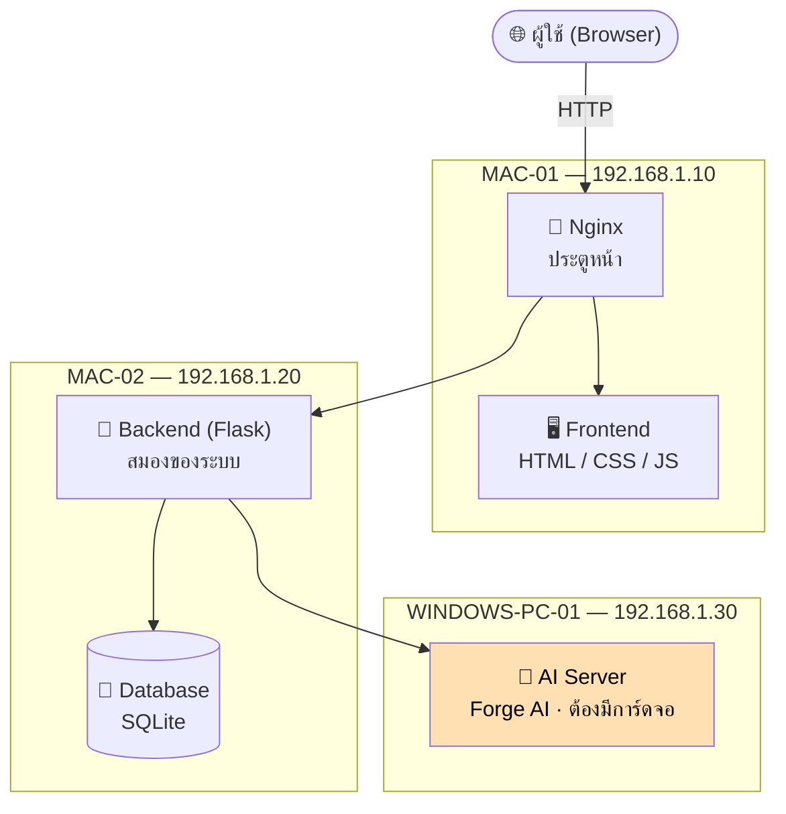
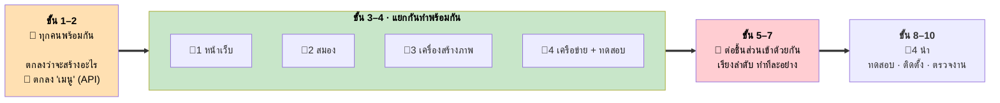

# Web App Flowchart — โปรเจกต์เว็บสร้างภาพด้วย AI

**ทีม 4 คน · คอมพิวเตอร์ 4 เครื่อง**

เอกสารวางแผนงานสำหรับโปรเจกต์เว็บแอปพลิเคชันสร้างภาพด้วย AI แบบกระจายบนหลายเครื่อง (Distributed System)
ทุกอย่างในนี้อ้างอิงจากภาพต้นฉบับ 3 ภาพ — [`1.png`](1.png) ระบบ · [`2.png`](2.png) ตำแหน่งงาน · [`3.png`](3.png) เครื่องคอมพิวเตอร์

---

## 📌 เริ่มอ่านตรงนี้

| ไฟล์ | ภาษา | อ่านเมื่อไหร่ |
|---|---|---|
| **[`WORK_ORDER_FLOWCHART.md`](WORK_ORDER_FLOWCHART.md)** | 🇹🇭 | **อยากรู้ว่าใครทำอะไรก่อนหลัง** — แผนผังลำดับงานทั้งโปรเจกต์ |
| **[`TEAM_ROLES_TH.md`](TEAM_ROLES_TH.md)** | 🇹🇭 | **อยากรู้ว่าตำแหน่งของฉันต้องทำอะไร** — รายการงานแต่ละคน + สิ่งที่ห้ามทำ |
| [`positions_preview.html`](positions_preview.html) | 🇹🇭 | เปิดในเบราว์เซอร์ ดูแบบมีรูป |

---

## ระบบที่กำลังจะสร้าง



**กฎข้อเดียวที่กำหนดทุกอย่าง:** หน้าเว็บ **ห้าม** คุยกับเครื่องสร้างภาพโดยตรง — ทุกคำขอต้องผ่านสมอง (Backend) เสมอ นั่นคือสิ่งที่ทำให้ตรวจล็อกอินได้ จดบันทึกได้ และจัดคิวได้

---

## ทีม 4 คน

| | ตำแหน่ง | สร้างอะไร | เครื่อง |
|---|---|---|---|
| 👤 **1** | **UX/UI Frontend** | หน้าเว็บที่ผู้ใช้เห็น · Bootstrap · JavaScript | `MAC-01` — `192.168.1.10` |
| 👤 **2** | **Flask Backend** | สมอง — ล็อกอิน · API · ฐานข้อมูล · Logging | `MAC-02` — `192.168.1.20` |
| 👤 **3** | **AI Engineer** | เครื่องสร้างภาพ — Forge AI · LoRA · คิว | `WINDOWS-PC-01` — `192.168.1.30` |
| 👤 **4** | **QA / DevOps + Nginx** | เครือข่าย · ประตูหน้า · ทดสอบ · ติดตั้ง · backup · คู่มือ | `WINDOWS-PC-02` + ดูแลทุกเครื่อง |

> `2.png` มีตำแหน่งที่ 5 (**Reverse Proxy, Routing**) แต่กำกับไว้ว่า **“ถ้ามี”** — ทีมนี้มี 4 คน งานนั้นจึงย้ายไปอยู่กับ **คนที่ 4**

---

## ลำดับการทำงาน



**แคบ → กว้าง → แคบ** · เริ่มพร้อมกัน → แยกกันทำ → กลับมารวมกัน

### 🔴 2 จุดที่ตัดสินว่าโปรเจกต์จะรอดไหม

1. **ขั้นที่ 2 — ตกลง “เมนู” (API)** ถ้ายังไม่ตกลง ไม่มีใครแยกไปทำพร้อมกันได้เลย ทุกคนจะนั่งรอกัน
2. **ขั้นที่ 5 — ต่อสมองเข้ากับเครื่องสร้างภาพ** ครั้งแรกที่คอมคนละเครื่องต้องคุยกัน **ยากที่สุด และพังทุกครั้งในรอบแรก — ทำแต่เนิ่นๆ**

---

## ⚠️ เรื่องที่ต้องเช็คก่อนเริ่ม

| # | เรื่อง | ใครเช็ค | เมื่อไหร่ |
|---|---|---|---|
| 1 | 🔴 **เครื่อง Windows มีการ์ดจอ NVIDIA จริงไหม** — Forge AI ต้องใช้ CUDA ซึ่ง Mac ใช้แทนไม่ได้ **ไม่มีภาพไหนบอกสเปกเครื่อง** ถ้าไม่มีการ์ดจอ แผนทั้งหมดต้องเปลี่ยน | คนที่ 3 | **วันแรก** |
| 2 | เครื่องที่ 4 ใช้ IP อะไร — `1.png` บอกแค่ `.10 / .20 / .30` | คนที่ 4 | ขั้น 2 |
| 3 | ใช้ port อะไร — ไม่มีภาพไหนระบุ | คนที่ 4 | ขั้น 2 |
| 4 | **API มี endpoint อะไรบ้าง** — ไม่มีภาพไหนบอก | คนที่ 2 | ขั้น 2 |
| 5 | ใช้ SQLite หรือ PostgreSQL — `1.png` บอก SQLite แต่ `3.png` แบบ 4 เครื่องบอก PostgreSQL | คนที่ 2 | ขั้น 1 |

---

## ไฟล์ทั้งหมด

```
.
├── 1.png  2.png  3.png              ภาพต้นฉบับ (source of truth)
│
├── WORK_ORDER_FLOWCHART.md      🇹🇭  ลำดับการทำงาน — เริ่มอ่านที่นี่
├── TEAM_ROLES_TH.md             🇹🇭  แต่ละตำแหน่งต้องทำอะไร
├── positions_preview.html       🇹🇭  เวอร์ชันดูในเบราว์เซอร์
│
├── PROJECT_WORKFLOW.md          🇬🇧  แผนงานละเอียด · dependency · milestone · risk
├── COMPUTER_ROLE_ALLOCATION.md  🇬🇧  เครื่องไหนทำหน้าที่อะไร + เหตุผล
├── FLOWCHART.md                 🇬🇧  แผนผัง 16 แบบ
├── MASTER_AGENT.md              🇬🇧  ตัวประสานงาน AI Agent
├── AGENT_COLLABORATION_RULES.md 🇬🇧  กฎการทำงานร่วมกัน · Git workflow
│
└── agents/                          AI Agent แยกตามตำแหน่ง
    ├── 01_UX_UI_FRONTEND_AGENT.md
    ├── 02_FLASK_BACKEND_AGENT.md
    ├── 03_AI_ENGINEER_AGENT.md
    ├── 04_QA_DEVOPS_AGENT.md
    └── 05_REVERSE_PROXY_ROUTING_AGENT.md
```

> **หมายเหตุ:** ไฟล์ 🇬🇧 ยังเป็นเวอร์ชัน **5 คน** (มีตำแหน่ง Reverse Proxy แยก) · ไฟล์ 🇹🇭 อัปเดตเป็น **4 คน** แล้ว
>
> แผนผัง Mermaid แสดงเป็นรูปบน GitHub, VS Code (ต้องมี extension) และ Obsidian

---

*ข้อมูลทั้งหมดอ้างอิงจากภาพ `1.png` `2.png` `3.png` · อะไรที่ไม่ได้อยู่ในภาพ ถือเป็นข้อเสนอแนะ ไม่ใช่ข้อบังคับ*
