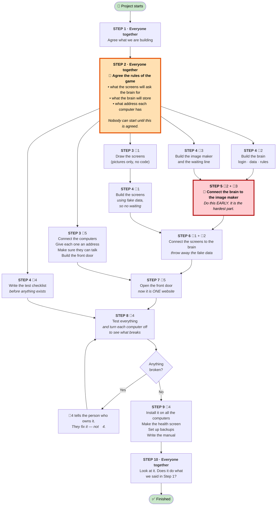
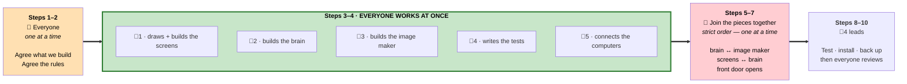
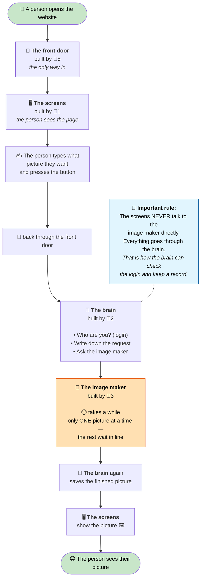
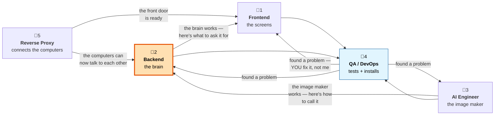

# Who Does What, and In What Order

**A simple map of the project. No technical detail — just the order of actions.**

The 5 positions (from `2.png`):

| | Position | In plain words |
|---|---|---|
| 👤 **1** | **UX/UI Frontend** | Builds the screens the user sees |
| 👤 **2** | **Flask Backend** | Builds the brain — logins, data, and the rules |
| 👤 **3** | **AI Engineer** | Builds the image maker |
| 👤 **4** | **QA / DevOps** | Tests everything, then installs it and keeps it alive |
| 👤 **5** | **Reverse Proxy / Routing** *(optional)* | Connects the computers and builds the front door |

---

## 1. The order of work — the whole project on one page

```mermaid
flowchart TD
    START([🚀 Project starts])

    START --> S1["<b>STEP 1 · Everyone together</b><br/>Agree what we are building"]

    S1 --> S2["<b>STEP 2 · Everyone together</b><br/>🔶 <b>Agree the rules of the game</b><br/>• what the screens will ask the brain for<br/>• what the brain will store<br/>• what address each computer has<br/><br/><i>Nobody can start until this is agreed.</i>"]

    S2 --> P5A["<b>STEP 3</b> 👤5<br/>Connect the computers<br/>Give each one an address<br/>Make sure they can talk<br/>Build the front door"]
    S2 --> P1A["<b>STEP 3</b> 👤1<br/>Draw the screens<br/>(pictures only, no code)"]

    P1A --> P1B["<b>STEP 4</b> 👤1<br/>Build the screens<br/><i>using fake data,<br/>so no waiting</i>"]
    S2 --> P2A["<b>STEP 4</b> 👤2<br/>Build the brain<br/>login · data · rules"]
    S2 --> P3A["<b>STEP 4</b> 👤3<br/>Build the image maker<br/>and the waiting line"]
    S2 --> P4A["<b>STEP 4</b> 👤4<br/>Write the test checklist<br/><i>before anything exists</i>"]

    P2A --> S5["<b>STEP 5</b> 👤2 + 👤3<br/>🔴 <b>Connect the brain to the image maker</b><br/><i>Do this EARLY. It is the hardest part.</i>"]
    P3A --> S5

    S5 --> S6["<b>STEP 6</b> 👤1 + 👤2<br/>Connect the screens to the brain<br/><i>throw away the fake data</i>"]
    P1B --> S6

    S6 --> S7["<b>STEP 7</b> 👤5<br/>Open the front door<br/><i>now it is ONE website</i>"]
    P5A --> S7

    S7 --> S8["<b>STEP 8</b> 👤4<br/>Test everything<br/><i>and turn each computer off<br/>to see what breaks</i>"]
    P4A --> S8

    S8 --> FIX{"Anything<br/>broken?"}
    FIX -->|Yes| BACK["👤4 tells the person who owns it.<br/><i>They fix it — not 👤4.</i>"]
    BACK --> S8

    FIX -->|No| S9["<b>STEP 9</b> 👤4<br/>Install it on all the computers<br/>Make the health screen<br/>Set up backups<br/>Write the manual"]

    S9 --> S10["<b>STEP 10 · Everyone together</b><br/>Look at it. Does it do what<br/>we said in Step 1?"]

    S10 --> DONE([✅ Finished])

    style S2 fill:#ffe0b2,stroke:#e65100,stroke-width:4px,color:#000
    style S5 fill:#ffcdd2,stroke:#b71c1c,stroke-width:4px,color:#000
    style START fill:#c8e6c9,color:#000
    style DONE fill:#c8e6c9,color:#000
```

### The two moments that decide whether this project succeeds

🔶 **Step 2 — agreeing the rules.**
Until everyone agrees *exactly* what the screens will ask for and what the brain will send back, **nobody can work in parallel.** Once it's agreed, four people can build at the same time. This is the single most valuable hour of the project.

🔴 **Step 5 — connecting the brain to the image maker.**
This is the first time two *different computers* have to work together. It is the hardest part, and it always breaks the first time. **Do it early, even with something fake.** Teams that leave it until the end run out of time.

---

## 2. The same thing, as a simple table

| Step | Who | What they do | They wait for… |
|---|---|---|---|
| **1** | 🤝 Everyone | Agree what we're building | nobody |
| **2** | 🤝 Everyone | 🔶 **Agree the rules of the game** | Step 1 |
| **3** | 👤 **5** | Connect the computers · build the front door | Step 2 |
| **3** | 👤 **1** | Draw the screens | Step 1 |
| **4** | 👤 **1** | Build the screens *(with fake data)* | their own drawings |
| **4** | 👤 **2** | Build the brain | Step 2 |
| **4** | 👤 **3** | Build the image maker | Step 2 |
| **4** | 👤 **4** | Write the test checklist | Step 2 |
| **5** | 👤 **2** + 👤 **3** | 🔴 Connect the brain to the image maker | both must be ready |
| **6** | 👤 **1** + 👤 **2** | Connect the screens to the brain | Step 5 |
| **7** | 👤 **5** | Open the front door | Step 6 |
| **8** | 👤 **4** | Test everything | Step 7 |
| **9** | 👤 **4** | Install · monitor · back up · write the manual | Step 8 passes |
| **10** | 🤝 Everyone | Final look | Step 9 |

---

## 3. Who can work at the same time?

```mermaid
flowchart LR
    A["<b>Steps 1–2</b><br/>🤝 Everyone<br/><i>one at a time</i><br/><br/>Agree what we build<br/>Agree the rules"]

    A ==> B

    subgraph B["<b>Steps 3–4 · EVERYONE WORKS AT ONCE</b>"]
        direction TB
        B1["👤1 · draws + builds the screens"]
        B2["👤2 · builds the brain"]
        B3["👤3 · builds the image maker"]
        B4["👤4 · writes the tests"]
        B5["👤5 · connects the computers"]
    end

    B ==> C["<b>Steps 5–7</b><br/>🔗 Join the pieces together<br/><i>strict order — one at a time</i><br/><br/>brain ↔ image maker<br/>screens ↔ brain<br/>front door opens"]

    C ==> D["<b>Steps 8–10</b><br/>👤4 leads<br/><br/>Test · install · back up<br/>then everyone reviews"]

    style B fill:#c8e6c9,stroke:#2e7d32,stroke-width:3px,color:#000
    style A fill:#ffe0b2,color:#000
    style C fill:#ffcdd2,color:#000
```

**The shape to remember:**
**Narrow → wide → narrow.**
Everyone together at the start, everyone apart in the middle, everyone together again at the end.

---

## 4. How the program actually works when someone uses it

*This is what all the work above is building.*

```mermaid
flowchart TD
    U(["👤 A person opens the website"])

    U --> D1["🚪 <b>The front door</b><br/>built by 👤5<br/><i>the only way in</i>"]

    D1 --> SC["🖥️ <b>The screens</b><br/>built by 👤1<br/><i>the person sees the page</i>"]

    SC --> ASK["✍️ The person types what<br/>picture they want<br/>and presses the button"]

    ASK --> D1B["🚪 back through the front door"]

    D1B --> BR["🧠 <b>The brain</b><br/>built by 👤2<br/><br/>• Who are you? (login)<br/>• Write down the request<br/>• Ask the image maker"]

    BR --> AI["🎨 <b>The image maker</b><br/>built by 👤3<br/><br/>⏱️ takes a while<br/>only ONE picture at a time —<br/>the rest wait in line"]

    AI --> BR2["🧠 <b>The brain</b> again<br/>saves the finished picture"]

    BR2 --> SC2["🖥️ <b>The screens</b><br/>show the picture 🖼️"]

    SC2 --> U2(["😀 The person sees their picture"])

    NOTE["📌 <b>Important rule:</b><br/>The screens NEVER talk to the<br/>image maker directly.<br/>Everything goes through the brain.<br/><i>That is how the brain can check<br/>the login and keep a record.</i>"]

    NOTE -.- BR

    style AI fill:#ffe0b2,stroke:#e65100,color:#000
    style NOTE fill:#e1f5fe,stroke:#01579b,color:#000
    style U fill:#c8e6c9,color:#000
    style U2 fill:#c8e6c9,color:#000
```

### The one thing that shapes the whole design

**The image maker is slow. Everything else is fast.**

Making a picture takes far longer than loading a page. So the brain **cannot just sit and wait** — it says *"got it, I'm working on it"* straight away, and the screens show a loading bar until the picture is ready.

That single fact is why there is a **waiting line** (👤3 builds it), why the screens need a **loading state** (👤1 builds it), and why the brain has to **remember the request** (👤2 builds it).

---

## 5. Who hands work to whom

```mermaid
flowchart LR
    P5["👤5<br/><b>Reverse Proxy</b><br/>connects the computers"]
    P1["👤1<br/><b>Frontend</b><br/>the screens"]
    P2["👤2<br/><b>Backend</b><br/>the brain"]
    P3["👤3<br/><b>AI Engineer</b><br/>the image maker"]
    P4["👤4<br/><b>QA / DevOps</b><br/>tests + installs"]

    P5 -->|"the computers can<br/>now talk to each other"| P2
    P5 -->|"the front door<br/>is ready"| P1
    P3 -->|"the image maker<br/>works — here's how<br/>to call it"| P2
    P2 -->|"the brain works —<br/>here's what to ask it for"| P1
    P1 --> P4
    P2 --> P4
    P3 --> P4
    P4 -->|"found a problem —<br/>YOU fix it, not me"| P1
    P4 -->|"found a problem"| P2
    P4 -->|"found a problem"| P3

    style P2 fill:#ffe0b2,stroke:#e65100,stroke-width:3px,color:#000
    style P4 fill:#e1f5fe,stroke:#01579b,color:#000
```

**Notice 👤2 (the brain) is in the middle of everything.** Everyone connects through them. That makes them the busiest person — and it means **if 👤2 falls behind, everybody falls behind.** Give them help first.

**And notice 👤4 never fixes anything.** They find problems and tell the owner. If QA starts fixing other people's work, nobody knows who owns what any more.

---

## 6. The short version

> 1. **Talk first.** Agree what you're building, and agree exactly how the pieces will talk to each other. *(Steps 1–2)*
> 2. **Then split up and build at the same time** — screens, brain, image maker, tests, network. Use fake data so nobody waits for anybody. *(Steps 3–4)*
> 3. **Join the pieces early**, starting with the hardest one: brain ↔ image maker. *(Steps 5–7)*
> 4. **Test it, install it, back it up, write it down.** *(Steps 8–9)*
> 5. **Look at what you built** and check it's what you said in Step 1. *(Step 10)*

---

*The 5 positions come from `2.png`. How the program works comes from `1.png`. The computers come from `3.png`.*
