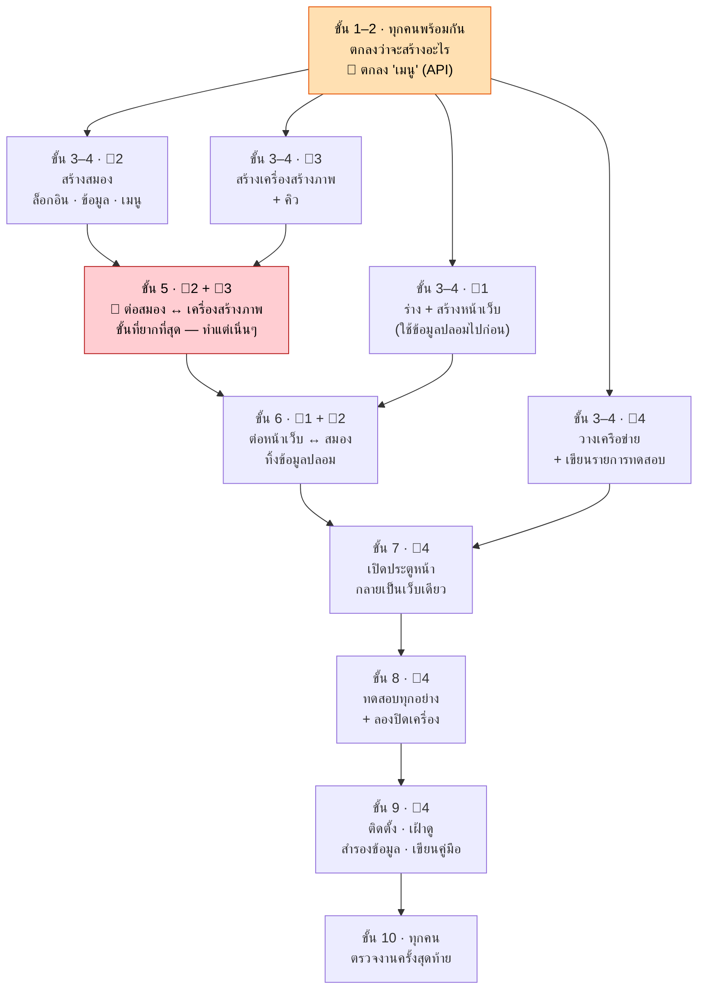
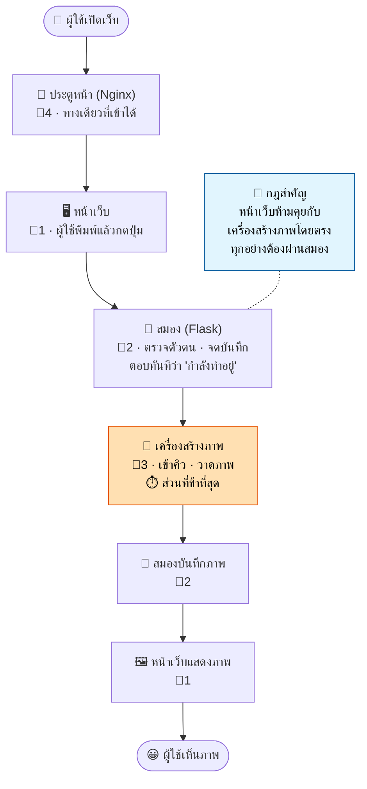

# แต่ละตำแหน่งต้องสร้างอะไรบ้าง

**คู่มือทีม · 4 คน · 4 เครื่อง**

เว็บสร้างภาพด้วย AI หนึ่งเว็บ แบ่งกันทำบนคอมพิวเตอร์ 4 เครื่อง แต่ละคนดูแลคนละส่วน
ไฟล์นี้คือรายการงานที่แต่ละคนต้องสร้าง **เรียงตามลำดับ** และ **สิ่งที่ห้ามไปแตะของคนอื่น**

> **ที่มา:** `1.png` (ระบบ) · `2.png` (ตำแหน่งงาน) · `3.png` (เครื่องคอมพิวเตอร์)
> อะไรที่ไม่ได้อยู่ในภาพทั้งสาม ถือเป็น **ข้อเสนอแนะ** ไม่ใช่ข้อบังคับ — ทีมเปลี่ยนได้

---

## เครื่องคอมพิวเตอร์ทั้ง 4

| เครื่อง | IP | รันอะไร | ใครดูแล |
|---|---|---|---|
| **MAC-01** | `192.168.1.10` | ประตูหน้า (Nginx) + หน้าเว็บ | Nginx = คนที่ 4 · หน้าเว็บ = คนที่ 1 |
| **MAC-02** | `192.168.1.20` | สมอง (Flask) + ฐานข้อมูล | คนที่ 2 |
| **WINDOWS-PC-01** | `192.168.1.30` | เครื่องสร้างภาพ (Forge AI) — **ต้องมีการ์ดจอ** | คนที่ 3 |
| **WINDOWS-PC-02** | ทุกเครื่อง | ทดสอบ · ติดตั้ง · สำรองข้อมูล | คนที่ 4 |

---

## ⚠️ ทีมมี 4 คน จึงไม่มีคนที่ 5

ตารางแบ่งหน้าที่ใน `2.png` มีตำแหน่งที่ 5 คือ **Reverse Proxy, Routing** แต่กำกับไว้ว่า **“ถ้ามี”**

เมื่อทีมมี 4 คน ตำแหน่งนี้จึงไม่มี และงานทั้งหมดย้ายไปอยู่กับ **คนที่ 4** ซึ่งกลายเป็น **QA / DevOps + Nginx**

ตำแหน่งนี้เหมาะที่สุด เพราะการวางเครือข่ายและติดตั้งประตูหน้าเป็นงาน Infrastructure และคนที่ 4 เป็นคนติดตั้งและดูแลระบบอยู่แล้ว

---

# ตำแหน่งงานทั้ง 4

---

## 👤 คนที่ 1 — UX/UI Frontend

**สร้าง: หน้าเว็บที่ผู้ใช้มองเห็นและกดใช้งาน**
**เครื่อง:** `MAC-01` — `192.168.1.10`
**สิ่งที่ส่งมอบ (จาก `2.png`):** หน้าเว็บ, Bootstrap, JavaScript

### ลำดับงานที่ต้องทำ

| # | งาน | รายละเอียด |
|---|---|---|
| **01** | **ร่างหน้าจอให้ครบทุกหน้า** | ร่างทุกหน้าลงกระดาษหรือ Figma **ก่อนเขียนโค้ดสักบรรทัด** แก้ภาพร่างถูกกว่าแก้เว็บที่สร้างเสร็จแล้วมาก |
| **02** | **กำหนดหน้าตาให้เหมือนกันทั้งเว็บ** | เลือกสี ฟอนต์ และรูปแบบปุ่มไว้ครั้งเดียว แล้วใช้ซ้ำทุกหน้า (Design System) |
| **03** | **สร้างหน้าเว็บ** | เขียน HTML + CSS โดยใช้ **Bootstrap** ช่วยจัดหน้า — หน้าล็อกอิน หน้าแกลเลอรี หน้าสร้างภาพ |
| **04** | **ทำให้ใช้ได้ทุกขนาดจอ** | ต้องใช้งานได้ทั้งบนมือถือและโน้ตบุ๊ก |
| **05** | **คุยกับสมอง** | เขียน **JavaScript** ส่งคำสั่งไปหาคนที่ 2 แล้วอ่านคำตอบกลับมา — **ใช้ข้อมูลปลอมไปก่อน** จะได้ไม่ต้องนั่งรอคนที่ 2 |
| **06** | **แสดงแถบโหลด** | การสร้างภาพใช้เวลาหลายวินาทีถึงเป็นนาที ถ้าไม่มีแถบนี้ ผู้ใช้จะคิดว่าเว็บค้างแล้วกดปุ่มซ้ำ |
| **07** | **แสดงภาพ และแสดงข้อผิดพลาดด้วย** | แสดงภาพที่สร้างเสร็จ และถ้ามีอะไรพลาด ให้บอกเป็นภาษาคน แทนที่จะเงียบไปเฉยๆ |

### 🚫 ห้ามทำ

- **ห้ามเรียกเครื่องสร้างภาพโดยตรง** — ทุกอย่างต้องผ่านสมอง
- ห้ามแตะฐานข้อมูล
- ห้ามเขียนโค้ดฝั่งเซิร์ฟเวอร์

### 🤝 ทำงานร่วมกับใคร

- บอก **คนที่ 2** ให้ชัดว่าหน้าเว็บต้องขออะไรบ้าง
- ส่งหน้าเว็บที่เสร็จแล้วให้ **คนที่ 4** เอาไปเสิร์ฟผ่านประตูหน้า
- แก้สิ่งที่ **คนที่ 4** ทดสอบแล้วเจอปัญหา

---

## 👤 คนที่ 2 — Flask Backend

**สร้าง: สมอง — ระบบล็อกอิน ข้อมูล และกฎการทำงาน**
**เครื่อง:** `MAC-02` — `192.168.1.20`
**สิ่งที่ส่งมอบ (จาก `2.png`):** Authentication, API, Database, Logging

> 🔴 **ตำแหน่งนี้งานหนักที่สุด** เพราะทุกส่วนต่อผ่านตรงนี้หมด — ถ้าคนที่ 2 ช้า ทั้งทีมช้าตาม

### ลำดับงานที่ต้องทำ

| # | งาน | รายละเอียด |
|---|---|---|
| **01** | 🔶 **เขียน “เมนู” (API)** | รายการว่าหน้าเว็บขออะไรได้บ้าง และจะได้อะไรกลับไป ให้ชัดเจน — **ทุกคนรอสิ่งนี้** ถ้ายังไม่ตกลงกัน คนอื่นเริ่มงานไม่ได้เลย |
| **02** | **สร้างระบบล็อกอิน** | สมัครสมาชิก เข้าสู่ระบบ ออกจากระบบ **เก็บรหัสผ่านแบบเข้ารหัส ห้ามเก็บเป็นข้อความอ่านได้** |
| **03** | **สร้างฐานข้อมูล** | ที่เก็บผู้ใช้ คำสั่งที่ขอเข้ามา และภาพที่สร้างเสร็จแล้ว |
| **04** | **บันทึกทุกอย่างที่เกิดขึ้น** | จดทุกคำขอและทุกความผิดพลาด เวลาระบบพังข้ามเครื่อง **log คือทางเดียวที่จะรู้ว่าเกิดอะไรขึ้นจริงๆ** |
| **05** | **เรียกเครื่องสร้างภาพ** | ส่งคำสั่งข้ามไปที่เครื่องของคนที่ 3 ที่ `192.168.1.30` แล้วรอรับภาพกลับมา |
| **06** | **ตอบกลับทันที ไม่ต้องรอ** | อย่าให้เบราว์เซอร์นั่งรอเป็นนาที ให้ตอบไปก่อนว่า “รับเรื่องแล้ว กำลังทำอยู่” แล้วค่อยส่งภาพให้ทีหลัง |
| **07** | **บันทึกผลลัพธ์** | เก็บภาพที่เสร็จแล้ว ผูกกับคนที่ขอมา แล้วส่งกลับไปให้หน้าเว็บ |
| **08** | **พังอย่างสุภาพ** | ถ้าเครื่องสร้างภาพปิดอยู่หรือคิวเต็ม ให้บอกไปตรงๆ **อย่าค้างไปเฉยๆ** |

### 🚫 ห้ามทำ

- ห้ามออกแบบหน้าเว็บ — เป็นงานของคนที่ 1
- **ห้ามรัน AI บนเครื่องนี้** — ต้องอยู่บนเครื่องของคนที่ 3
- **ห้ามแก้เมนู (API) โดยไม่บอกคนที่ 1 กับคนที่ 3**

### 🤝 ทำงานร่วมกับใคร

- **ทุกคน** — ตำแหน่งนี้เป็นศูนย์กลาง
- ส่งเมนู (API) ให้ **คนที่ 1** เอาไปสร้างงาน
- ตกลงกับ **คนที่ 3** ว่าจะขอภาพยังไง

---

## 👤 คนที่ 3 — AI Engineer

**สร้าง: เครื่องสร้างภาพ**
**เครื่อง:** `WINDOWS-PC-01` — `192.168.1.30`
**สิ่งที่ส่งมอบ (จาก `2.png`):** Image Generation, Image Editing, Model/LoRA, ทดสอบ API, Queue

### ลำดับงานที่ต้องทำ

| # | งาน | รายละเอียด |
|---|---|---|
| **00** | 🔴 **เช็คการ์ดจอ — วันแรกเลย** | ยืนยันว่าเครื่องนี้มีการ์ดจอ **NVIDIA** จริง โปรแกรม AI รันไม่ได้ถ้าไม่มี และ Mac ใช้แทนไม่ได้ — **ถ้าไม่มี แผนทั้งหมดต้องเปลี่ยน และควรรู้ตั้งแต่วันแรก ไม่ใช่สัปดาห์ที่สี่** |
| **01** | **ติดตั้งโปรแกรม AI** | ติดตั้ง **Forge AI** พร้อมไดรเวอร์การ์ดจอ |
| **02** | **โหลดโมเดล** | โมเดลหลัก + ไฟล์ **LoRA** ที่ใช้เปลี่ยนสไตล์ภาพ ไฟล์ใหญ่มาก **เริ่มโหลดตั้งแต่วันแรก** แล้วไปทำอย่างอื่นระหว่างรอ |
| **03** | **สร้างภาพจากข้อความ** | ผู้ใช้พิมพ์ “แมวนอนบนชายหาด” แล้วได้ภาพ — ฟีเจอร์หลักของทั้งเว็บ |
| **04** | **แก้ไขภาพที่มีอยู่แล้ว** | เอาภาพที่ผู้ใช้มีอยู่มาแก้ไข |
| **05** | **สร้างคิว (Queue)** | การ์ดจอสร้างภาพได้ **ทีละ 1 ภาพเท่านั้น** ถ้ามีคำขอเข้ามาพร้อมกัน 2 อันแล้วไม่มีคิว **เครื่องจะพัง** — ไม่ใช่ของเสริม แต่เป็นสิ่งที่ต้องมี |
| **06** | **เปิดช่องให้สมองเรียกเข้ามา** | ให้เครื่องของคนที่ 2 ส่งคำขอผ่านเครือข่ายเข้ามาได้ |
| **07** | **ทดสอบ API ของตัวเอง** | พิสูจน์ว่าใช้ได้จริง **ก่อน** ส่งต่อให้คนที่ 2 — ลองยิงพร้อมกัน 2 คำขอ ดูว่าคิวรับไหวหรือเครื่องพัง |
| **08** | **บอกเวลาที่ใช้จริง** | จับเวลาว่าสร้างภาพ 1 ภาพใช้กี่วินาที แล้วบอกทั้งทีม — **แถบโหลดของคนที่ 1, เวลารอของคนที่ 2 และ timeout ของคนที่ 4 ตั้งค่าจากตัวเลขนี้ตัวเดียวกัน** |

### 🚫 ห้ามทำ

- **ห้ามรับคำขอตรงจากเบราว์เซอร์** — มีแค่สมองเท่านั้นที่เรียกได้
- **ห้ามเขียนลงฐานข้อมูล** — ส่งภาพกลับไป แล้วให้คนที่ 2 เป็นคนบันทึก
- ห้ามเอาไฟล์โมเดลขนาดใหญ่ขึ้น Git

### 🤝 ทำงานร่วมกับใคร

- **คนที่ 2 เท่านั้น** — มีคนเดียวที่เรียกเครื่องนี้ได้
- บอกทั้งทีมว่า **สร้างภาพใช้เวลาจริงเท่าไหร่**

---

## 👤 คนที่ 4 — QA / DevOps + Nginx

**สร้าง: เครือข่ายและประตูหน้า แล้วทดสอบทุกอย่างและดูแลระบบ**
**เครื่อง:** `WINDOWS-PC-02` + Nginx บน `MAC-01` — **ดูแลทั้ง 4 เครื่อง**
**สิ่งที่ส่งมอบ (จาก `2.png`):** ทดสอบระบบ, เขียนคู่มือ, Deployment, Dashboard, Backup **+ Nginx / Reverse Proxy** (รับมาจากคนที่ 5)

### ส่วน A · เครือข่าย — **ทำก่อนเพื่อน**

> ถ้าส่วนนี้ยังไม่เสร็จ **ไม่มีใครต่อระบบเข้าด้วยกันได้เลย** และถ้าปล่อยไว้ทำทีหลัง จะเป็นปัญหาที่หาสาเหตุยากที่สุด

| # | งาน | รายละเอียด |
|---|---|---|
| **01** | **ตั้ง IP ให้ทุกเครื่อง** | `.10` หน้าเว็บ · `.20` สมอง · `.30` เครื่องสร้างภาพ |
| **02** | 🔶 **พิสูจน์ว่าทุกเครื่องคุยกันได้** | ping จากทุกเครื่องไปหาทุกเครื่อง — **ถ้าข้อนี้ยังไม่ผ่าน ต่อระบบอะไรไม่ได้เลย** |
| **03** | **ติดตั้งประตูหน้า** | **Nginx** — ที่อยู่เว็บเดียวสำหรับทั้งระบบ ติดตั้งบนเครื่องของคนที่ 1 |
| **04** | **ชี้ทางให้ไปถูกเครื่อง** | คำขอหน้าเว็บ → คนที่ 1 · คำขอข้อมูล → สมองของคนที่ 2 |
| **05** | **ตั้งให้ประตูหน้ารอนานพอ** | ค่าเริ่มต้นรอ 60 วินาทีแล้วตัด ถ้าสร้างภาพนานกว่านั้นจะถูกตัด — แล้วจะดูเหมือน **โค้ดคนที่ 2 มีบั๊ก ทั้งที่จริงคือประตูหน้า** ถามคนที่ 3 ว่าใช้เวลาจริงเท่าไหร่ แล้วตั้งให้สูงกว่า |
| **06** | **ซ่อนเครื่องสร้างภาพกับฐานข้อมูล** | คนภายนอกต้องเข้าถึงตรงๆ ไม่ได้ มีแค่สมองเท่านั้น |

### ส่วน B · การทดสอบ

> **คุณเป็นคนเดียวที่เห็นระบบทั้งหมดพร้อมกัน** สิ่งเหล่านี้ไม่มีใครทดสอบให้

| # | งาน | รายละเอียด |
|---|---|---|
| **07** | **เขียนรายการทดสอบไว้ก่อน** | พอเมนู (API) ตกลงเสร็จ ให้เขียนเลยว่า “ใช้งานได้” แปลว่าอะไร — **เขียนก่อนที่ใครจะเริ่มสร้าง** |
| **08** | **ทดสอบทีละส่วน** | หน้าเว็บใช้ได้ไหม สมองตอบไหม เครื่องสร้างภาพสร้างได้ไหม |
| **09** | **ทดสอบตอนต่อรวมกันแล้ว** | คนจริง กดปุ่มจริง ได้ภาพจริง ข้ามทุกเครื่อง |
| **10** | **ทดสอบตอนคนใช้เยอะ** | หลายคนขอภาพพร้อมกัน — **ตรงนี้แหละที่ระบบจะพัง** |
| **11** | **ลองปิดเครื่องทีละเครื่อง** | ปิดเครื่องสร้างภาพดู — เว็บขึ้นข้อความบอกชัดๆ หรือค้างไปเฉยๆ? ทำกับทุกเครื่อง แล้วจดว่าอะไรพังบ้าง |

### ส่วน C · ติดตั้งและดูแลระบบ

> เริ่มส่วนนี้ได้ **ต่อเมื่อการทดสอบผ่านหมดแล้วเท่านั้น**

| # | งาน | รายละเอียด |
|---|---|---|
| **12** | **ติดตั้งลงเครื่องให้ถูกตัว** | หน้าเว็บ → `.10` · สมอง → `.20` · เครื่องสร้างภาพ → `.30` **เปิดฐานข้อมูลก่อน แล้วเปิดประตูหน้าเป็นอันสุดท้าย** |
| **13** | **ทำหน้าจอเช็คสุขภาพระบบ** | หน้าเดียวที่บอกว่าแต่ละเครื่องยังทำงานอยู่ไหม — จะได้รู้ก่อนผู้ใช้ |
| **14** | **ตั้ง backup แล้วลอง restore จริง** | สำรองฐานข้อมูลกับรูปภาพ แล้ว **ลองกู้คืนกลับมาจริงๆ** — backup ที่ไม่เคยลองกู้คืน **ไม่นับว่าเป็น backup** |
| **15** | **เขียนคู่มือ** | เล่มหนึ่งสำหรับผู้ใช้ อีกเล่มสำหรับคนดูแลระบบ |

### 🚫 ห้ามทำ

- **ห้ามไปแก้โค้ดของคนอื่น** — เจอปัญหาแล้วอธิบายให้ชัด **แล้วส่งให้เจ้าของไปแก้เอง**
- ห้ามเปิดเครื่องสร้างภาพหรือฐานข้อมูลให้คนภายนอกเข้าถึง
- ห้ามแก้หน้าเว็บของคนที่ 1 — คุณแค่เอาไปเสิร์ฟ ไม่ใช่คนเขียน
- ห้ามติดตั้งเวอร์ชันที่ยังไม่ผ่านการทดสอบ

### 🤝 ทำงานร่วมกับใคร

- **ทุกคน** — ถ้าเครือข่ายยังไม่เสร็จ ไม่มีใครต่อระบบได้
- เป็นคนให้ **ไฟเขียว** ว่าพร้อมเปิดใช้งานจริง

---

## ⚠️ ระวังงานของคนที่ 4 ล้นมือ

พอทีมมี 4 คน คนที่ 4 จะมีงานถึง **15 อย่าง** มากที่สุดในทีม และ **2 อย่างในนั้นเป็นคอขวดของทั้งโปรเจกต์**

- **เครือข่าย** ต้องเสร็จก่อนใครจะต่อระบบได้ *(ต้นทาง)*
- **การทดสอบ** ต้องผ่านก่อนถึงจะเปิดใช้งานได้ *(ปลายทาง)*

**คำแนะนำ:**
1. **ให้คนที่ 4 เริ่มทำเครือข่ายตั้งแต่สัปดาห์แรก** อย่ารอไปทำตอนท้ายเหมือนงาน QA ทั่วไป
2. **ช่วงท้ายควรให้อีก 3 คนมาช่วยทดสอบด้วย** คนที่ 4 ทำคนเดียวทั้งเครือข่าย ทดสอบ ติดตั้ง ดูแล สำรองข้อมูล และเขียนคู่มือ ไม่ไหวแน่นอน

---

# ใครทำงานตอนไหน

| ขั้น | เกิดอะไรขึ้น | ใครทำ |
|---|---|---|
| **1** | ตกลงกันว่าจะสร้างอะไร | 🤝 ทุกคนพร้อมกัน |
| **2** | 🔶 **ตกลง “เมนู”** — หน้าเว็บจะขออะไร ได้อะไรกลับ | 🤝 ทุกคนพร้อมกัน |
| **3–4** | **ทุกคนสร้างส่วนของตัวเอง** ← *ทำพร้อมกันได้* | 👤1 หน้าเว็บ · 👤2 สมอง · 👤3 เครื่องสร้างภาพ · 👤4 เครือข่าย + ทดสอบ |
| **5** | 🔴 ต่อสมองเข้ากับเครื่องสร้างภาพ — **ขั้นที่ยากที่สุด ทำแต่เนิ่นๆ** | 👤2 + 👤3 |
| **6** | ต่อหน้าเว็บเข้ากับสมอง — ทิ้งข้อมูลปลอมได้แล้ว | 👤1 + 👤2 |
| **7** | เปิดประตูหน้า — ตอนนี้กลายเป็นเว็บเดียว | 👤4 |
| **8** | ทดสอบทุกอย่าง รวมถึงลองปิดเครื่อง | 👤4 |
| **9** | ติดตั้ง เฝ้าดู สำรองข้อมูล เขียนคู่มือ | 👤4 |
| **10** | ดูสิ่งที่สร้างเสร็จ — ตรงกับที่ตกลงกันไว้ในขั้นที่ 1 ไหม | 🤝 ทุกคนพร้อมกัน |

**รูปแบบที่ต้องจำ: แคบ → กว้าง → แคบ**
เริ่มพร้อมกัน → แยกกันทำ → กลับมารวมกัน

---

# เว็บที่เสร็จแล้วทำงานยังไง

| ลำดับ | ใคร | เกิดอะไรขึ้น |
|---|---|---|
| 1 | 👤 **4** | ผู้ใช้เปิดเว็บ → เข้ามาทาง **ประตูหน้า** ซึ่งเป็นทางเดียวที่เข้าได้ |
| 2 | 👤 **1** | ผู้ใช้เห็น **หน้าเว็บ** → พิมพ์ว่าอยากได้ภาพอะไร แล้วกดปุ่ม |
| 3 | 👤 **2** | **สมอง** ตรวจตัวตน แล้วจดคำขอไว้ |
| 4 | 👤 **2** | สมองตอบทันทีว่า **“กำลังทำอยู่”** → หน้าเว็บขึ้นแถบโหลด |
| 5 | 👤 **3** | **เครื่องสร้างภาพ** เข้าคิว รอการ์ดจอ แล้ววาดภาพ — *ตรงนี้คือส่วนที่ช้า* |
| 6 | 👤 **2** | สมองบันทึกภาพที่เสร็จแล้ว ผูกกับคนที่ขอ |
| 7 | 👤 **1** | หน้าเว็บ **แสดงภาพ** → แถบโหลดหายไป เสร็จเรียบร้อย |

---

## 🔑 กฎข้อเดียวที่กำหนดทุกอย่าง

> **หน้าเว็บ “ห้าม” คุยกับเครื่องสร้างภาพโดยตรง ทุกคำขอต้องผ่านสมองเสมอ**

เพราะนั่นคือสิ่งที่ทำให้สมอง:
1. **ตรวจตัวตนได้** (ใครขอ ล็อกอินหรือยัง)
2. **จดบันทึกได้** (ใครขออะไร เมื่อไหร่)
3. **จัดคิวได้** (ไม่ให้การ์ดจอพัง)

**ถ้าข้ามขั้นนี้ จะเสียทั้ง 3 อย่างพร้อมกันทันที**

---

## สรุปสั้นๆ

1. **คุยกันก่อน** — ตกลงว่าจะสร้างอะไร และตกลง **“เมนู” (API)** ให้ชัด *(ขั้น 1–2)*
2. **แล้วแยกกันทำพร้อมกัน** — หน้าเว็บ สมอง เครื่องสร้างภาพ เครือข่าย ทดสอบ **ใช้ข้อมูลปลอมไปก่อน จะได้ไม่ต้องรอกัน** *(ขั้น 3–4)*
3. **ต่อระบบแต่เนิ่นๆ** เริ่มจากอันที่ยากที่สุด: สมอง ↔ เครื่องสร้างภาพ *(ขั้น 5–7)*
4. **ทดสอบ ติดตั้ง สำรองข้อมูล เขียนคู่มือ** *(ขั้น 8–9)*
5. **ดูสิ่งที่สร้างเสร็จ** ว่าตรงกับที่ตกลงกันไว้ตอนแรกไหม *(ขั้น 10)*

---

## ⚠️ เรื่องที่ยังต้องเช็ค

| # | เรื่อง | ใครเช็ค | เมื่อไหร่ |
|---|---|---|---|
| 1 | 🔴 **เครื่อง Windows มีการ์ดจอ NVIDIA จริงไหม** — ไม่มีภาพไหนบอกสเปกเครื่อง | คนที่ 3 | **วันแรก** |
| 2 | เครื่องที่ 4 ใช้ IP อะไร — `1.png` บอกแค่ `.10 / .20 / .30` | คนที่ 4 | ขั้นที่ 2 |
| 3 | ใช้ port อะไร — ไม่มีภาพไหนระบุ | คนที่ 4 | ขั้นที่ 2 |
| 4 | **เมนู (API) มีอะไรบ้าง** — ไม่มีภาพไหนบอก | คนที่ 2 | ขั้นที่ 2 |
| 5 | ใช้ SQLite หรือ PostgreSQL — `1.png` บอก SQLite แต่ `3.png` แบบ 4 เครื่องบอก PostgreSQL | คนที่ 2 | ขั้นที่ 1 |

---

*ตำแหน่งงานและหน้าที่มาจาก `2.png` · ระบบและเลข IP มาจาก `1.png` · เครื่องคอมพิวเตอร์มาจาก `3.png`*
*ดูแบบรูปสวยๆ ได้ที่: `positions_preview.html`*
