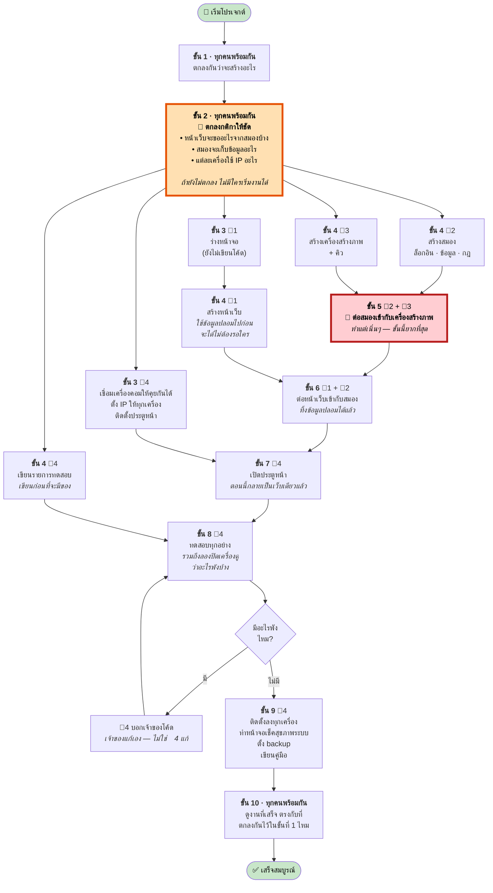
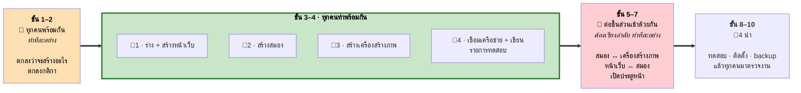
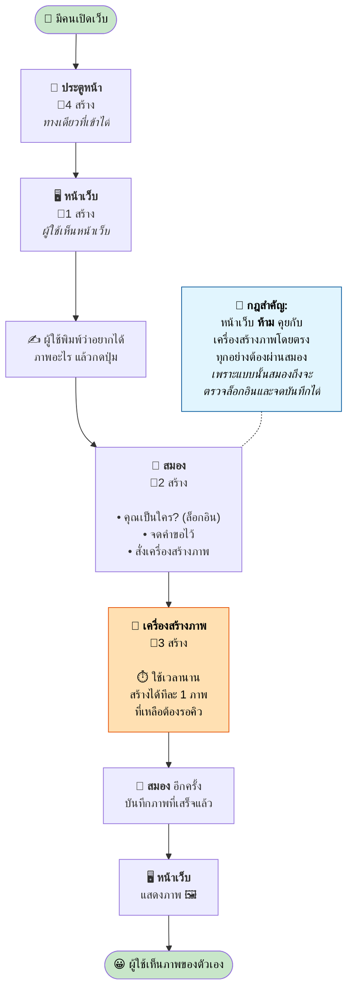
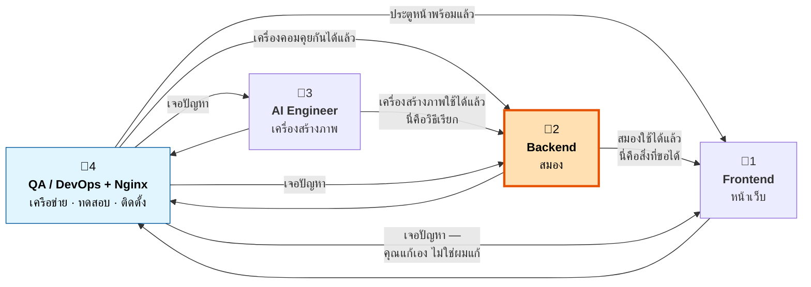

# ลำดับการทำงาน — ใครทำอะไร ตอนไหน

**แผนผังง่ายๆ ของโปรเจกต์ ไม่มีศัพท์เทคนิค — มีแค่ลำดับว่าใครต้องทำอะไรก่อนหลัง**

> **ทีมมี 4 คน** · `2.png` มีตำแหน่งที่ 5 (Reverse Proxy, Routing) แต่กำกับว่า **“ถ้ามี”** — เมื่อทีมมี 4 คน งานนั้นย้ายไปอยู่กับ **คนที่ 4**

## ตำแหน่งงานทั้ง 4 (จาก `2.png`)

| | ตำแหน่ง | พูดง่ายๆ คือ |
|---|---|---|
| 👤 **1** | **UX/UI Frontend** | สร้างหน้าเว็บที่ผู้ใช้เห็น |
| 👤 **2** | **Flask Backend** | สร้างสมอง — ล็อกอิน ข้อมูล และกฎการทำงาน |
| 👤 **3** | **AI Engineer** | สร้างเครื่องสร้างภาพ |
| 👤 **4** | **QA / DevOps + Nginx** | วางเครือข่าย + ประตูหน้า แล้วทดสอบ ติดตั้ง และดูแลระบบ |

---

## 1. ลำดับการทำงานทั้งหมด ในหน้าเดียว

### 2 จุดที่ตัดสินว่าโปรเจกต์นี้จะรอดหรือไม่รอด

🔶 **ขั้นที่ 2 — ตกลงกติกา**
ถ้ายังไม่ตกลงให้ชัดว่าหน้าเว็บจะขออะไร และสมองจะตอบอะไรกลับ **ไม่มีใครแยกไปทำงานพร้อมกันได้เลย** ทุกคนจะนั่งรอกันไปมา แต่พอตกลงเสร็จ ทั้ง 4 คนแยกไปทำพร้อมกันได้ทันที — **หนึ่งชั่วโมงของการคุยตรงนี้ มีค่ามากกว่าโค้ดทั้งสัปดาห์**

🔴 **ขั้นที่ 5 — ต่อสมองเข้ากับเครื่องสร้างภาพ**
นี่คือครั้งแรกที่ **คอมพิวเตอร์คนละเครื่อง** ต้องทำงานร่วมกัน มันยากที่สุด และมัน **พังทุกครั้งในรอบแรก** — **ให้ทำแต่เนิ่นๆ** แม้จะต้องใช้ของปลอมไปก่อนก็ตาม ทีมที่เก็บไว้ทำท้ายสุด มักไม่มีเวลาแก้

---

## 2. ตารางเดียวกัน แบบอ่านง่าย

| ขั้น | ใคร | ทำอะไร | รออะไรอยู่ |
|---|---|---|---|
| **1** | 🤝 ทุกคน | ตกลงกันว่าจะสร้างอะไร | ไม่ต้องรอใคร |
| **2** | 🤝 ทุกคน | 🔶 **ตกลงกติกาให้ชัด** | ขั้น 1 |
| **3** | 👤 **4** | เชื่อมเครื่องคอม · ติดตั้งประตูหน้า | ขั้น 2 |
| **3** | 👤 **1** | ร่างหน้าจอ | ขั้น 1 |
| **4** | 👤 **1** | สร้างหน้าเว็บ *(ใช้ข้อมูลปลอม)* | ภาพร่างของตัวเอง |
| **4** | 👤 **2** | สร้างสมอง | ขั้น 2 |
| **4** | 👤 **3** | สร้างเครื่องสร้างภาพ | ขั้น 2 |
| **4** | 👤 **4** | เขียนรายการทดสอบ | ขั้น 2 |
| **5** | 👤 **2** + 👤 **3** | 🔴 ต่อสมองเข้ากับเครื่องสร้างภาพ | ทั้งคู่ต้องเสร็จก่อน |
| **6** | 👤 **1** + 👤 **2** | ต่อหน้าเว็บเข้ากับสมอง | ขั้น 5 |
| **7** | 👤 **4** | เปิดประตูหน้า | ขั้น 6 |
| **8** | 👤 **4** | ทดสอบทุกอย่าง | ขั้น 7 |
| **9** | 👤 **4** | ติดตั้ง · เฝ้าดู · backup · เขียนคู่มือ | ขั้น 8 ผ่าน |
| **10** | 🤝 ทุกคน | ตรวจงานครั้งสุดท้าย | ขั้น 9 |

---

## 3. ใครทำงานพร้อมกันได้บ้าง

**รูปแบบที่ต้องจำ: แคบ → กว้าง → แคบ**
เริ่มพร้อมกัน → แยกกันทำ → กลับมารวมกัน

---

## 4. เว็บที่เสร็จแล้วทำงานยังไง

*นี่คือสิ่งที่งานทั้งหมดข้างบนกำลังสร้างอยู่*

### สิ่งเดียวที่กำหนดรูปร่างของทั้งระบบ

**เครื่องสร้างภาพช้า ส่วนอย่างอื่นเร็วหมด**

การสร้างภาพใช้เวลานานกว่าโหลดหน้าเว็บมาก สมองจึง **นั่งรอเฉยๆ ไม่ได้** ต้องตอบไปก่อนว่า *“รับเรื่องแล้ว กำลังทำอยู่”* แล้วหน้าเว็บก็ขึ้นแถบโหลดไว้จนกว่าภาพจะเสร็จ

ความจริงข้อนี้ข้อเดียว คือเหตุผลที่ต้องมี **คิว** (👤3 สร้าง) · ต้องมี **แถบโหลด** (👤1 สร้าง) · และสมองต้อง **จำคำขอไว้ได้** (👤2 สร้าง)

---

## 5. ใครส่งงานให้ใคร

**สังเกตว่า 👤2 (สมอง) อยู่ตรงกลางของทุกอย่าง** ทุกคนต่อผ่านคนนี้ ทำให้เป็นคนที่งานหนักที่สุด — และแปลว่า **ถ้า 👤2 ช้า ทั้งทีมช้าตาม** ควรช่วยคนนี้ก่อนใคร

**และสังเกตว่า 👤4 ไม่แก้โค้ดให้ใครเลย** หน้าที่คือหาปัญหาแล้วส่งให้เจ้าของ ถ้า QA ไปแก้โค้ดของคนอื่น จะไม่มีใครรู้ว่าใครเป็นเจ้าของอะไรอีกต่อไป

---

## ⚠️ 6. ระวังงานของคนที่ 4 ล้นมือ

พอทีมมี 4 คน คนที่ 4 ต้องรับงานของคนที่ 5 มาด้วย ทำให้มีงาน **15 อย่าง** มากที่สุดในทีม และ **2 อย่างเป็นคอขวดของทั้งโปรเจกต์:**

| คอขวด | ทำไมสำคัญ |
|---|---|
| **เครือข่าย** *(ต้นทาง)* | ต้องเสร็จก่อน ไม่งั้นคนที่ 2 เรียกคนที่ 3 ไม่ได้ — ต่อระบบไม่ได้เลย |
| **การทดสอบ** *(ปลายทาง)* | ต้องผ่านก่อน ถึงจะเปิดใช้งานได้ |

**คำแนะนำ:**
1. **ให้คนที่ 4 เริ่มทำเครือข่ายตั้งแต่สัปดาห์แรก** อย่ารอไปทำตอนท้ายเหมือนงาน QA ทั่วไป
2. **ช่วงท้ายให้อีก 3 คนมาช่วยทดสอบด้วย** — คนที่ 4 ทำคนเดียวทั้งเครือข่าย ทดสอบ ติดตั้ง ดูแลระบบ backup และเขียนคู่มือ ไม่ไหวแน่นอน

---

## สรุปสั้นๆ

> 1. **คุยกันก่อน** ตกลงว่าจะสร้างอะไร และตกลงให้ชัดว่าแต่ละส่วนจะคุยกันยังไง *(ขั้น 1–2)*
> 2. **แล้วแยกกันทำพร้อมกัน** — หน้าเว็บ สมอง เครื่องสร้างภาพ เครือข่าย **ใช้ข้อมูลปลอมไปก่อน จะได้ไม่ต้องรอกัน** *(ขั้น 3–4)*
> 3. **ต่อชิ้นส่วนแต่เนิ่นๆ** เริ่มจากอันที่ยากที่สุด: สมอง ↔ เครื่องสร้างภาพ *(ขั้น 5–7)*
> 4. **ทดสอบ ติดตั้ง backup เขียนคู่มือ** *(ขั้น 8–9)*
> 5. **ตรวจงาน** ว่าตรงกับที่ตกลงกันไว้ตอนแรกไหม *(ขั้น 10)*

---

*ตำแหน่งงานมาจาก `2.png` · ระบบและเลข IP มาจาก `1.png` · เครื่องคอมพิวเตอร์มาจาก `3.png`*
*รายละเอียดงานของแต่ละตำแหน่ง ดูที่ `TEAM_ROLES_TH.md` · ดูแบบรูปสวยๆ ที่ `positions_preview.html`*
