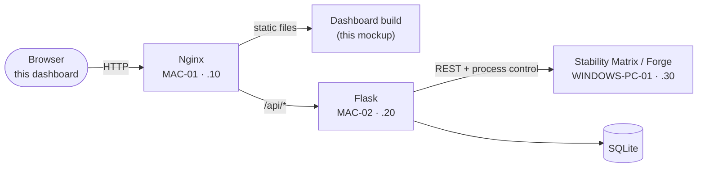

# Stability Matrix Web UI — Design & Architecture Study

> **Reference file** for the Stability Matrix web dashboard concept.
> 🇹🇭 เอกสารออกแบบ UI สำหรับแดชบอร์ดจัดการเครื่องสร้างภาพ (Stability Matrix) — มี mockup ที่กดเล่นได้จริงใน [`stability-matrix-ui-mockup.html`](stability-matrix-ui-mockup.html)
>
> | Artifact | Where |
> |---|---|
> | This study | `Work/stability-matrix-ui-study.md` |
> | Interactive mockup (open in a browser) | [`Work/stability-matrix-ui-mockup.html`](stability-matrix-ui-mockup.html) |
> | Hosted preview (same mockup, no setup) | <https://claude.ai/code/artifact/89492f1b-14c3-4132-8c68-f28368bc39db> |

---

# Part I — Original brief

*The sections below are the original AI study this file was created from, kept as the baseline brief. The boilerplate HTML that closed the original study has been superseded by the full interactive mockup file above.*

## 1. Core objectives & UX principles

Stability Matrix functions as a central hub to manage multiple AI interfaces (like ComfyUI, Automatic1111, SD.Next) and their respective models (Checkpoints, LoRAs). A web interface for it must prioritize:

- **Centralized control** — clear visibility of active interfaces and their running statuses.
- **Asset accessibility** — quick sorting, tagging, and previewing of large model files.
- **Resource monitoring** — real-time feedback on CPU/GPU usage, download speeds, and console logs.
- **Creative focus** — a dark-themed layout to minimize eye strain and let generated imagery pop.

## 2. Suggested layout & component architecture

A **fixed-sidebar dashboard layout** handles this complexity without cluttering the screen:

```
+-----------------------------------------------------------------------+
|  Sidebar     |  Main Content Area                                     |
|              |  Header: Active Environment / System Status (GPU/VRAM) |
|  - Home      |  +--------------------------------------------------+  |
|  - Packages  |  |                                                  |  |
|  - Models    |  |  Dynamic Workspace Context                       |  |
|  - Browser   |  |  (e.g., Grid of Installed Packages or            |  |
|  - Outputs   |  |   Model Browser Card Grid)                       |  |
|  - Settings  |  |                                                  |  |
|              |  +--------------------------------------------------+  |
|  [Launch UI] |  Console Drawer (collapsible)                          |
+-----------------------------------------------------------------------+
|  Bottom Status Bar: Running Processes / Global Download Progress      |
+-----------------------------------------------------------------------+
```

**Key modules:**

- **Sidebar navigation** — compact icon-plus-text menu: Dashboard, Packages, Model Manager, CivitAI Browser, Outputs, Settings.
- **Package grid / cards** — each installed WebUI (e.g. ComfyUI) is a card showing status (*Stopped, Running, Updating*) with explicit actions (Launch, Update, Open WebUI).
- **Model Manager** — split-pane: category filters left (Checkpoints, LoRA, VAE…), searchable card grid right with file size and previews.
- **Integrated console** — a collapsible bottom drawer showing real-time terminal output of running Python processes.

## 3. Visual identity

- **Theme:** deep slate/charcoal dark mode (`#0F172A` → `#1E293B`) for a professional, IDE-like feel.
- **Accent:** vibrant indigo/electric violet (`#6366F1`) for active states, success badges, execution actions.
- **Typography:** monospace for system paths and console logs (JetBrains Mono / Fira Code); clean sans-serif for interface text (Inter).

---

# Part II — Extended technical outline

*Everything below extends the brief into something the team can build against. It follows the same marker convention as the agent files: 🤖 = recommendation, open to team override.*

## 4. Where this fits the 4-machine architecture

This dashboard is a **management console for the AI machine** (`WINDOWS-PC-01`, `192.168.1.30`) — the box that runs Forge/ComfyUI. It obeys the project's one rule: **the browser never talks to `.30` directly.** Every panel in the UI maps to a Flask endpoint; Flask brokers the calls to the AI machine.



Ownership per `AGENT_COLLABORATION_RULES.md`: the UI itself is `01_UX_UI_FRONTEND_AGENT` territory (`frontend/`); the endpoints in §8 are a **proposal** for `02_FLASK_BACKEND_AGENT` to take into `docs/API_CONTRACT.md` at ขั้น 2 (CP-2). If the team treats this as an ops/monitoring tool instead, it shifts to `04_QA_DEVOPS_AGENT` — decide at CP-1.

## 5. Component inventory

### 5.1 App shell (persistent)

| Component | Contents | Live data source |
|---|---|---|
| Sidebar | Logo · nav (6 views) · running-count badge · system-load mini widget · quick-launch button | WS `system`, WS `processes` |
| Header | Page title · global search (`⌘K`) · GPU/VRAM chips · connection pill | WS `system` |
| Status bar | Running-process chips (click → console) · active download + progress · console toggle · version | WS `processes`, WS `downloads` |
| Console drawer | Per-process tabs · level-colored log lines · autoscroll · clear | WS `logs/{proc}` |
| Toast stack | Success / info / warning notifications, auto-dismiss | client events |

### 5.2 Views

| View | Job | Key components | States to design |
|---|---|---|---|
| **Dashboard** | "Is everything healthy, what's happening now?" | 4 stat tiles (GPU util + sparkline, VRAM meter, temp meter, disk) · package quick-list · download queue · recent outputs strip | idle vs busy GPU, empty queue |
| **Packages** | Install / launch / update the WebUIs | package cards (status badge, version, port, size, Launch/Stop, Open WebUI, Logs, Update w/ progress) · add-package tile | running, stopped, **updating** (progress), update-available, install failed |
| **Model Manager** | Find and manage local model files | category rail w/ counts · base-model chips (SD 1.5/SDXL/Flux) · search · sort · card grid (type chip, size, update dot) | empty category, no search hits |
| **CivitAI Browser** | Discover and import remote models | search/sort/SFW-toggle bar · result cards (creator, downloads, rating) · Import → queued state | queued, rate-limited, needs API key |
| **Outputs** | Review generated images | date-grouped grid · lightbox with full generation metadata + copy-prompt | empty day, lightbox |
| **Settings** | Configure paths, keys, behavior | path inputs · symlink/copy radio · API keys · theme/language selects · toggles · save | validation errors, unsaved changes 🤖 |

### 5.3 Interaction essentials

- **Every asynchronous action has a visible state** — launch shows the badge flip, update shows a determinate bar, import shows queue progress. (Same rule the frontend agent file enforces: no frozen UI, ever.)
- **Logs stream, never poll-and-replace** — append lines over WS, autoscroll with a user-off switch, cap the buffer (~5 000 lines).
- **Optimistic status flips with reconciliation** — clicking Stop flips the badge instantly; the WS event confirms or reverts. 🤖
- **Destructive actions confirm** (delete model, remove package); everything else is one click.
- **Keyboard:** `⌘K` global search · `Esc` closes modal/drawer · tab order follows visual order · `:focus-visible` ring on everything interactive.
- **Reduced motion respected** (`prefers-reduced-motion` kills pulses/transitions).

## 6. Design tokens

### 6.1 Color (dark-first — dark-only in v1, a deliberate choice, not an omission)

| Token | Value | Used for |
|---|---|---|
| `bg/app` | `#020617` slate-950 | chrome: sidebar, cards, status bar |
| `bg/workspace` | `#0F172A` slate-900 | main content ground |
| `border` | `#1E293B` slate-800 | all hairlines (hover: slate-700) |
| `ink/primary` | `#F1F5F9` slate-100 | headings, values |
| `ink/secondary` | `#94A3B8` slate-400 | body, descriptions |
| `ink/muted` | `#64748B` slate-500 | labels, timestamps |
| `accent` | `#6366F1` indigo-500/600 | primary buttons, active nav, meters, selection |
| `status/running` | `#34D399` emerald-400 | running badge/dot, connected, OK logs |
| `status/updating` | `#FBBF24` amber-400 | updating badge, update-available, WARN, hot temp |
| `status/error` | `#FB7185` rose-400 | errors, ERR logs, critical temp |
| `status/stopped` | slate-600/500 | stopped dot/badge |

Rules (validated with the dataviz palette checker against the dark surface — all five hues pass ≥3:1 contrast):

- **Status is never color-alone** — a badge is always dot + word ("● Running"), meters pair with a number.
- **No categorical series palette exists in this UI** — base-model chips (SD 1.5 / SDXL / Flux) are neutral slate with text labels; identity lives in the label, not a hue. Meters are single-hue indigo that switches to amber/rose only on thresholds (VRAM > 85 %, temp > 75/85 °C).
- Status hues are reserved: never reuse emerald/amber/rose for decoration.

### 6.2 Type

| Role | Face | Notes |
|---|---|---|
| UI | `Inter, ui-sans-serif, system-ui, …, "Noto Sans Thai"` | self-host Inter later; Thai fallback included for i18n |
| Data/console | `"JetBrains Mono", ui-monospace, Menlo, …` | paths, ports, seeds, logs, all stat digits |
| Numerals | `tabular-nums` everywhere digits update in place | stops layout jitter on live stats |

Scale: 10–11 px uppercase tracked labels · 13–14 px body · 16 px card titles · 18–20 px page title. Density is compact/IDE-like on purpose.

### 6.3 Shape & motion

- Radius: cards `12px` (rounded-xl), controls `8px`, chips full.
- Elevation by border + fill, not shadows (flat IDE feel); toasts get the one shadow.
- Motion: 150–250 ms ease transitions; `animate-pulse` only on live dots and the Updating badge.

## 7. Real-time spec 🤖

One WebSocket (or SSE) connection multiplexing channels; REST for commands.

| Channel | Payload | Drives |
|---|---|---|
| `system` | `{gpu_util, vram_used, vram_total, temp, disk_free}` every ~2 s | stat tiles, sidebar widget, header chips, sparkline |
| `processes` | `{id, status, port, started_at}` on change | badges, dots, status-bar chips, buttons |
| `logs/{proc}` | `{ts, level, line}` streamed | console drawer |
| `downloads` | `{id, name, total_mb, done_mb, speed}` every ~1 s | status bar, downloads card, import buttons |

Connection pill states: **Connected** (emerald) / **Reconnecting…** (amber, auto-retry with backoff) / **Offline** (rose + last-updated timestamp on stale tiles).

## 8. API sketch (proposal for `docs/API_CONTRACT.md`) 🤖

Nouns not verbs, per the backend agent's conventions. Long operations return a job id immediately — same pattern the backend already mandates for image generation.

| Method | Path | Purpose |
|---|---|---|
| GET | `/api/packages` | list + status |
| POST | `/api/packages/{id}/launch` · `/stop` | control; returns job id |
| POST | `/api/packages/{id}/update` | update; progress via WS |
| GET | `/api/models?type=&base=&q=&sort=` | model library |
| POST | `/api/models/import` | `{civitai_id}` → download job |
| DELETE | `/api/models/{id}` | remove (confirm in UI) |
| GET | `/api/civitai/search?q=&type=&sort=&nsfw=` | proxied browse (key stays server-side) |
| GET | `/api/outputs?date=&page=` | gallery with generation metadata |
| GET/PUT | `/api/settings` | paths, link mode, keys (write-only), toggles |
| WS | `/ws` | channels in §7 |

## 9. What the mockup does and doesn't do

`stability-matrix-ui-mockup.html` is **one file, zero build step** — open it in a browser (Tailwind loads from CDN, so it needs internet; the hosted preview link at the top needs nothing).

Simulated and fully interactive: view routing, launch/stop with cascading state (badges, status bar, GPU load reacts), SD.Next update flow with progress, live console streams per tab, download queue with speeds and completion, model filtering/sorting/search (`⌘K`), CivitAI import → queue, outputs lightbox with copy-prompt, settings toasts. **Nothing touches a server** — all data is client-side fiction, which makes it exactly the mock the frontend agent file asks for ("build the whole UI before the Backend exists").

Not in v1 (next candidates): model detail side-panel with trigger words + "connected to" packages · add-package catalog flow · auth screens (the project requires login — design once the auth mode is chosen at CP-2) · light theme · Thai localization pass.

## 10. Open questions for the team

1. **Tailwind vs Bootstrap.** `2.png` pins **Bootstrap** for the product frontend; this brief asked for Tailwind, so the mockup uses it. Either port the visual system to Bootstrap 5 (tokens in §6 translate 1-to-1 to CSS variables) or get Master-Agent approval to adopt Tailwind — the rules treat any new frontend dependency as an approval item. The *design* survives either choice.
2. **Scope.** Is this dashboard part of the user-facing app (person 1) or an internal ops console (person 4)?
3. **Auth.** Session vs JWT decides the connection pill's 401 behavior and every fetch wrapper.
4. **NSFW policy** for the CivitAI browser — the SFW toggle default is a product decision, decide before demo day.
5. **Where GPU stats come from** — Stability Matrix's API vs `nvidia-smi` polling on `.30`; person 3 owns that answer.

---

*Prepared 17 Jul 2026. Part I preserves the original AI study; Part II is 🤖 recommendation throughout — the team's decisions at CP-1/CP-2 override it.*
